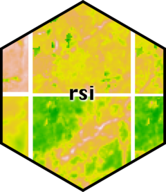
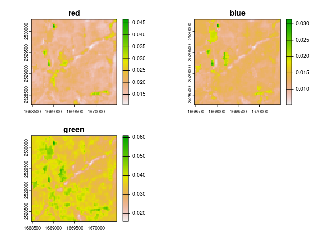
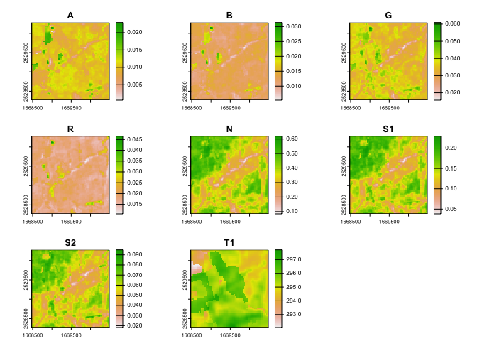
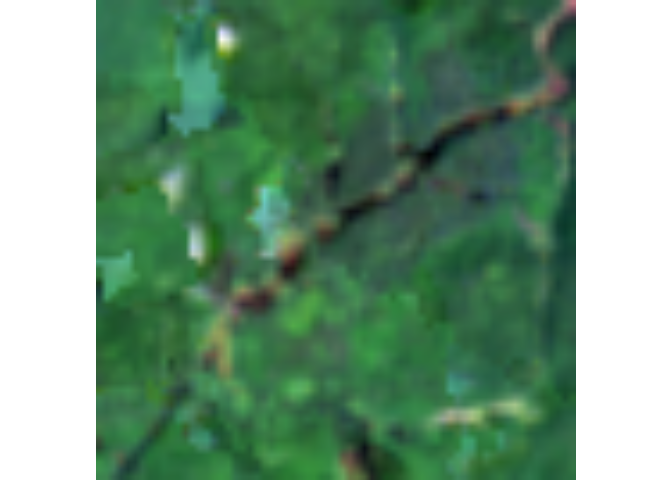
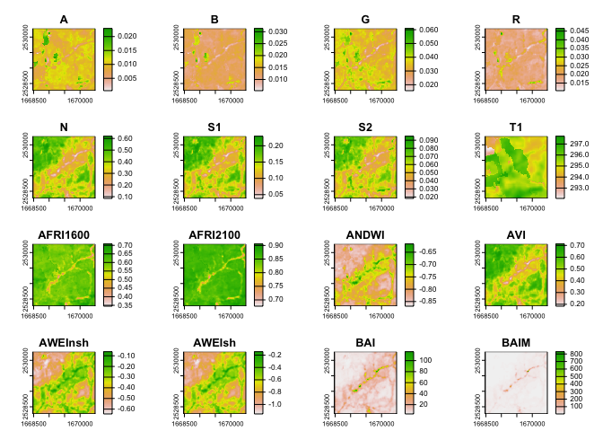
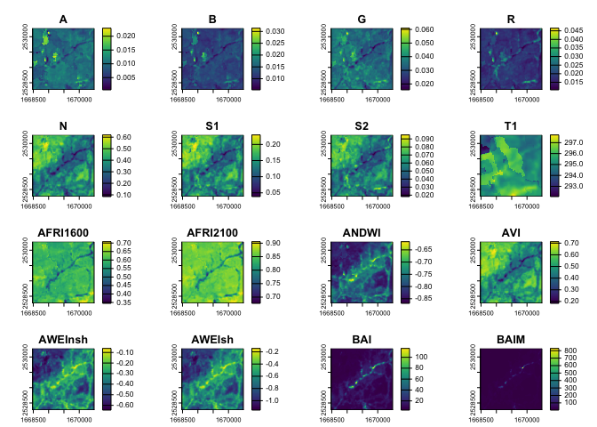

<!-- README.md is generated from README.Rmd. Please edit that file -->

# rsi <a href="https://permian-global-research.github.io/rsi/"></a>

<!-- badges: start -->

[](https://github.com/Permian-Global-Research/rsi/actions/workflows/R-CMD-check.yaml)
[](https://app.codecov.io/gh/Permian-Global-Research/rsi?branch=main)
[](https://opensource.org/license/apache-2-0)
[](https://lifecycle.r-lib.org/articles/stages.html#maturing)
[](https://www.repostatus.org/#active)
[](https://CRAN.R-project.org/package=rsi)
[](https://zenodo.org/doi/10.5281/zenodo.10926857)
[](https://github.com/ropensci/software-review/issues/636)
<!-- badges: end -->

The goal of rsi is to address several **r**epeated **s**patial
**i**nfelicities, by providing utility functions that save you typing
and help avoid **r**epetitive **s**tress **i**njuries. Specifically, rsi
provides:

  - An interface to the **R**some – excuse me, [*Awesome* Spectral
    Indices
    project](https://github.com/awesome-spectral-indices/awesome-spectral-indices),
    providing the list of indices directly in R as a friendly tibble,
  - A method for efficiently *calculating* those awesome spectral
    indices using local rasters, enabling **r**apid **s**pectral
    **i**nference,
  - A method for downloading STAC data – excuse me, **r**etriving
    **S**TAC **i**nformation – from any STAC server, with additional
    helpers for downloading Landsat, Sentinel-1, and Sentinel-2 data
    from free and public STAC servers providing **r**apid **s**atellite
    **i**magery,
  - A **r**aster **s**tack **i**ntegration method for combining multiple
    rasters containing distinct data sets into a single raster stack.

The functions in rsi are designed around letting you use the tools
you’re familiar with to process raster data using compute that you
control – whether that means grabbing imagery with your laptop to add
some context to a map, or grabbing tranches of data to a virtual server
hosted near your data provider for lightning fast downloads. The outputs
from rsi functions are standard objects – usually the file paths of
raster files saved to your hard drive – meaning it’s easy to incorporate
rsi into broader spatial data processing workflows.

## Installation

You can install rsi via:

``` r
install.packages("rsi")
```

You can install the development version of rsi from
[GitHub](https://github.com/Permian-Global-Research/rsi) using
[pak](https://pak.r-lib.org/):

``` r
# install.packages("pak")
pak::pak("Permian-Global-Research/rsi")
```

## Example

The `spectral_indices()` function provides a tibble with data from the
[Awesome Spectral Indices
project](https://github.com/awesome-spectral-indices/awesome-spectral-indices):

``` r
library(rsi)

spectral_indices()
#> # A tibble: 243 × 9
#>    application_domain bands     contributor   date_of_addition formula long_name
#>    <chr>              <list>    <chr>         <chr>            <chr>   <chr>    
#>  1 vegetation         <chr [2]> https://gith… 2021-11-17       (N - 0… Aerosol …
#>  2 vegetation         <chr [2]> https://gith… 2021-11-17       (N - 0… Aerosol …
#>  3 water              <chr [6]> https://gith… 2022-09-22       (B + G… Augmente…
#>  4 vegetation         <chr [2]> https://gith… 2021-09-20       (1 / G… Anthocya…
#>  5 vegetation         <chr [3]> https://gith… 2022-04-08       N * ((… Anthocya…
#>  6 vegetation         <chr [4]> https://gith… 2021-05-11       (N - (… Atmosphe…
#>  7 vegetation         <chr [4]> https://gith… 2021-05-14       sla * … Adjusted…
#>  8 vegetation         <chr [2]> https://gith… 2022-04-08       (N * (… Advanced…
#>  9 water              <chr [4]> https://gith… 2021-09-18       4.0 * … Automate…
#> 10 water              <chr [5]> https://gith… 2021-09-18       B + 2.… Automate…
#> # ℹ 233 more rows
#> # ℹ 3 more variables: platforms <list>, reference <chr>, short_name <chr>
```

The first time `spectral_indices()` is called it will download the most
up-to-date version of the spectral indices JSON file, and then write the
resulting table to a cache file in `tools::R_user_dir("rsi")`. After
that, `spectral_indices()` will only download a new file if the cache is
older than 1 day, or if the `update_cache` argument is `TRUE`, in order
to provide the most up-to-date data as quickly as possible. If offline,
`spectral_indices()` will always fall back to the cache or, if no cache
file exists, a (possibly out-of-date) data file included in rsi itself.

Separately, the `get_stac_data()` function provides a generic interface
for downloading composite images from any accessible STAC catalog. For
instance, we could download a cloud-masked composite of Landsat’s
visible layers using `get_stac_data()` and a few helper functions from
rsi:

``` r
aoi <- sf::st_point(c(-74.912131, 44.080410))
aoi <- sf::st_set_crs(sf::st_sfc(aoi), 4326)
aoi <- sf::st_buffer(sf::st_transform(aoi, 5070), 1000)

landsat_image <- get_stac_data(
  aoi,
  start_date = "2022-06-01",
  end_date = "2022-06-30",
  pixel_x_size = 30,
  pixel_y_size = 30,
  asset_names = c("red", "blue", "green"),
  stac_source = "https://planetarycomputer.microsoft.com/api/stac/v1/",
  collection = "landsat-c2-l2",
  mask_band = "qa_pixel",
  mask_function = landsat_mask_function,
  output_filename = tempfile(fileext = ".tif"),
  item_filter_function = landsat_platform_filter,
  platforms = c("landsat-9", "landsat-8")
)

terra::plot(terra::rast(landsat_image))
```



For common data sets, rsi also provides helper functions which provide
most of these arguments for you. For instance, that `get_stac_data()`
call could be as simple as:

``` r
landsat_image <- get_landsat_imagery(
  aoi,
  start_date = "2022-06-01",
  end_date = "2022-08-30",
  output_filename = tempfile(fileext = ".tif")
)
terra::plot(terra::rast(landsat_image))
```



Note that we’ve been plotting each band individually so far by calling
`terra::plot()`. We could also use `terra::plotRGB()` (after
`terra::stretch()`ing the band values) to see what this mosaic of images
would look like to the human eye:

``` r
landsat_image |> 
  terra::rast(lyrs = c("R", "G", "B")) |> 
  terra::stretch() |>
  terra::plotRGB()
```



By default, these functions download data from Microsoft’s Planetary
Computer API, using a number of configuration options set in
`rsi_band_mapping` objects provided by the package. You can see these
default configuration options by printing the band mapping objects, and
can adjust them through arguments to any `get_*` function in the
package.

``` r
landsat_band_mapping$planetary_computer_v1
#> An rsi band mapping object with attributes:
#> names mask_band mask_function stac_source collection_name query_function download_function sign_function class
#> 
#> coastal    blue   green     red   nir08  swir16  swir22    lwir  lwir11 
#>     "A"     "B"     "G"     "R"     "N"    "S1"    "S2"     "T"    "T1"
```

We can put these pieces together and calculate as many spectral indices
as we can based on our downloaded Landsat imagery. The
`calculate_indices()` function, well, calculates indices, using subsets
of our `spectral_indices()` data frame:

``` r
available_indices <- filter_bands(
  bands = names(terra::rast(landsat_image))
)

indices <- calculate_indices(
  landsat_image,
  available_indices,
  output_filename = tempfile(fileext = ".tif")
)

# Plot the first handful of spatial indices
terra::plot(terra::rast(indices))
```



And last but not least, rsi includes a utility for efficiently combining
rasters containing different data about the same location into a
[VRT](https://gdal.org/en/latest/drivers/raster/vrt.html), which allows
programs like GDAL to treat these separate data sources as a single
file. For instance, we can combine our Landsat imagery with the derived
indices:

``` r
raster_stack <- stack_rasters(
  c(landsat_image, indices),
  tempfile(fileext = ".vrt")
)

# The first few panels are now Landsat measurements, not indices:
terra::plot(terra::rast(raster_stack))
```



This can be extremely useful as a way to create predictor bricks and
other multi-band rasters from various data sources.

## Contributing

We love contributions\! See our [contribution
guide](https://github.com/Permian-Global-Research/rsi/blob/main/.github/CONTRIBUTING.md)
for pointers on how to make your contribution as easy to accept as
possible – in particular, consider [opening an
issue](https://github.com/Permian-Global-Research/rsi/issues/new/choose)
with a [minimal reprex](https://www.tidyverse.org/help/#reprex) to make
sure that we understand what your changes are meant to do.

## License

Copyright 2023 Permian Global Research, Limited.

Licensed under the Apache License, Version 2.0 (the “License”); you may
not use this file except in compliance with the License.

You may obtain a copy of the License at:

<https://www.apache.org/licenses/LICENSE-2.0>

Unless required by applicable law or agreed to in writing, software
distributed under the License is distributed on an “AS IS” BASIS,
WITHOUT WARRANTIES OR CONDITIONS OF ANY KIND, either express or implied.
See the License for the specific language governing permissions and
limitations under the License.
