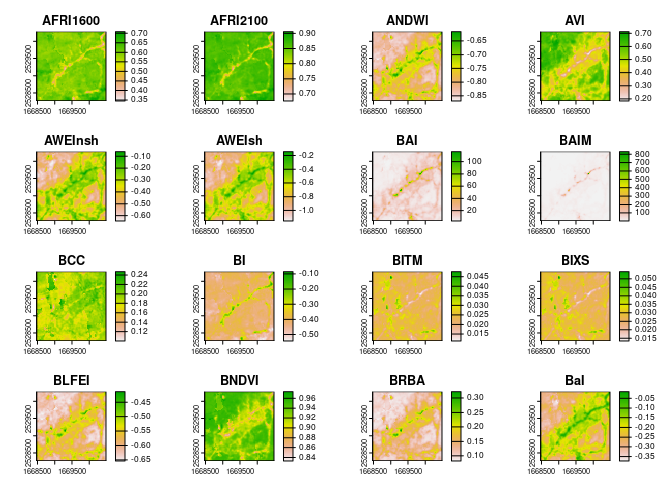

<!-- README.md is generated from README.Rmd. Please edit that file -->

# rsi <a href="https://permian-global-research.github.io/rsi/"></a>

<!-- badges: start -->

[](https://github.com/Permian-Global-Research/rsi/actions/workflows/R-CMD-check.yaml)
[](https://app.codecov.io/gh/Permian-Global-Research/rsi?branch=main)
[](https://CRAN.R-project.org/package=rsi)
[](https://choosealicense.com/licenses/mit/)
[](https://lifecycle.r-lib.org/articles/stages.html#maturing)
[](https://www.repostatus.org/#active)
<!-- badges: end -->

The goal of rsi is to address several **r**epeated **s**patial
**i**nfelicities, by providing utility functions that save you typing
and help avoid **r**epetitive **s**tress **i**njuries. Specifically, rsi
provides:

- An interface to the **R**some – excuse me, [*Awesome* Spectral Indices
  project](https://github.com/awesome-spectral-indices/awesome-spectral-indices),
  providing the list of indices directly in R as a friendly tibble,
- A method for efficiently *calculating* those awesome spectral indices
  using local rasters, enabling **r**apid **s**pectral **i**nference,
- A method for downloading STAC data – excuse me, **r**etriving **S**TAC
  **i**nformation – from any STAC server, with additional helpers for
  downloading Landsat, Sentinel-1, and Sentinel-2 data from free and
  public STAC servers providing **r**apid **s**atellite **i**magery,
- A **r**aster **s**tack **i**ntegration method for combining multiple
  rasters containing distinct data sets into a single raster stack.

## Installation

You can install the development version of rsi from
[GitHub](https://github.com/) with:

``` r
# install.packages("pak")
pak::pak("Permian-Global-Research/rsi")
```

## Example

The `spectral_indices()` function provides a tibble with data from the
[*Awesome* Spectral Indices
project](https://github.com/awesome-spectral-indices/awesome-spectral-indices):

``` r
library(rsi)

spectral_indices()
#> # A tibble: 231 × 9
#>    application_domain bands     contributor   date_of_addition formula long_name
#>    <chr>              <list>    <chr>         <chr>            <chr>   <chr>    
#>  1 vegetation         <chr [2]> https://gith… 2021-11-17       (N - 0… Aerosol …
#>  2 vegetation         <chr [2]> https://gith… 2021-11-17       (N - 0… Aerosol …
#>  3 water              <chr [6]> https://gith… 2022-09-22       (B + G… Augmente…
#>  4 vegetation         <chr [2]> https://gith… 2021-09-20       (1 / G… Anthocya…
#>  5 vegetation         <chr [3]> https://gith… 2022-04-08       N * ((… Anthocya…
#>  6 vegetation         <chr [4]> https://gith… 2021-05-11       (N - (… Atmosphe…
#>  7 vegetation         <chr [4]> https://gith… 2021-05-14       sla * … Adjusted…
#>  8 vegetation         <chr [2]> https://gith… 2022-04-08       (N * (… Advanced…
#>  9 water              <chr [4]> https://gith… 2021-09-18       4.0 * … Automate…
#> 10 water              <chr [5]> https://gith… 2021-09-18       B + 2.… Automate…
#> # ℹ 221 more rows
#> # ℹ 3 more variables: platforms <list>, reference <chr>, short_name <chr>
```

The first time `spectral_indices()` is called it will download the most
up-to-date version of the spectral indices JSON file, and then write the
resulting table to a cache file in `tools::R_user_dir("rsi")`. After
that, `spectral_indices()` will only download a new file if the cache is
older than 1 day, or if the `update_cache` argument is `TRUE`, in order
to provide the most up-to-date data as quickly as possible. If offline,
`spectral_indices()` will always fall back to the cache or, if no cache
file exists, a (possibly out-of-date) data file included in rsi itself.

Separately, the `get_stac_data()` function provides a generic interface
for downloading composite images from any accessible STAC catalog. For
instance, we could download a cloud-masked composite of Landsat’s
visible layers using `get_stac_data()` and a few helper functions from
rsi:

``` r
aoi <- sf::st_point(c(-74.912131, 44.080410))
aoi <- sf::st_set_crs(sf::st_sfc(aoi), 4326)
aoi <- sf::st_buffer(sf::st_transform(aoi, 5070), 1000)

landsat_image <- get_stac_data(aoi,
  start_date = "2022-06-01",
  end_date = "2022-08-30",
  pixel_x_size = 30,
  pixel_y_size = 30,
  asset_names = c("red", "blue", "green"),
  stac_source = "https://planetarycomputer.microsoft.com/api/stac/v1/",
  collection = "landsat-c2-l2",
  query_function = query_planetary_computer,
  mask_band = "qa_pixel",
  mask_function = landsat_mask_function,
  item_filter_function = landsat_platform_filter,
  platforms = c("landsat-9", "landsat-8"),
  output_filename = tempfile(fileext = ".tif")
)

terra::plot(terra::rast(landsat_image))
```


For these common use cases, however, rsi also provides helper functions
which provide most of these arguments for you. For instance, that
`get_stac_data()` call could be as simple as:

``` r
landsat_image <- get_landsat_imagery(
  aoi,
  start_date = "2022-06-01",
  end_date = "2022-08-30",
  output_filename = tempfile(fileext = ".tif")
)
terra::plot(terra::rast(landsat_image))
```


By default, these functions download data from Microsoft’s Planetary
Computer API, using a number of configuration options set in
`rsi_band_mapping` objects provided by the package. You can see these
default configuration options by printing the band mapping objects, and
can adjust them through arguments to any `get_*` function in the
package.

``` r
landsat_band_mapping$planetary_computer_v1
#> coastal    blue   green     red   nir08  swir16  swir22    lwir  lwir11 
#>     "A"     "B"     "G"     "R"     "N"    "S1"    "S2"     "T"    "T1" 
#> attr(,"mask_band")
#> [1] "qa_pixel"
#> attr(,"mask_function")
#> function (raster) 
#> {
#>     raster == 21824
#> }
#> <bytecode: 0x10c8e95d0>
#> <environment: namespace:rsi>
#> attr(,"stac_source")
#> [1] "https://planetarycomputer.microsoft.com/api/stac/v1/"
#> attr(,"collection_name")
#> [1] "landsat-c2-l2"
#> attr(,"query_function")
#> function (q, subscription_key = Sys.getenv("rsi_pc_key")) 
#> {
#>     if (subscription_key == "") {
#>         rstac::items_sign(rstac::get_request(q), rstac::sign_planetary_computer())
#>     }
#>     else {
#>         rstac::items_sign(rstac::get_request(q), rstac::sign_planetary_computer(headers = c(`Ocp-Apim-Subscription-Key` = subscription_key)))
#>     }
#> }
#> <bytecode: 0x10c8e91e0>
#> <environment: namespace:rsi>
#> attr(,"class")
#> [1] "rsi_band_mapping"
```

We can put these pieces together and calculate as many spectral indices
as we can based on our downloaded Landsat imagery. The
`calculate_indices()` function, well, calculates indices, using subsets
of our `spectral_indices()` data frame:

``` r
available_indices <- filter_bands(
  bands = names(terra::rast(landsat_image))
)

indices <- calculate_indices(
  landsat_image, 
  available_indices,
  output_filename = tempfile(fileext = ".tif")
)

# Plot the first handful of spatial indices
terra::plot(terra::rast(indices))
```



And last but not least, rsi includes a utility for efficiently combining
rasters containing different data about the same location into a
[VRT](https://gdal.org/drivers/raster/vrt.html), which allows programs
like GDAL to treat these separate data sources as a single file. For
instance, we can combine our Landsat imagery with the derived indices:

``` r
raster_stack <- stack_rasters(
  c(landsat_image, indices), 
  tempfile(fileext = ".vrt")
)

# The first few panels are now Landsat measurements, not indices:
terra::plot(terra::rast(raster_stack))
```


This can be extremely useful as a way to create predictor bricks and
other multi-band rasters from various data sources.
