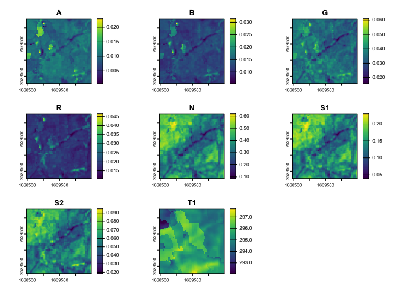

<!-- README.md is generated from README.Rmd. Please edit that file -->

# rsi

<!-- badges: start -->
<!-- badges: end -->

The goal of rsi is to address several **r**epeated **s**patial
**i**nfelicities, by providing utility functions that save you typing
and help avoid **r**epetitive **s**tress **i**njuries. Specifically, rsi
provides:

- An interface to the **R**some – excuse, me [*Awesome* Spectral Indices
  project](https://github.com/awesome-spectral-indices/awesome-spectral-indices),
  providing the list of indices directly in R as a friendly tibble,
- A method for efficiently *calculating* those awesome spectral indices
  using local rasters, enabling **r**apid **s**pectral **i**nference,
- A method for downloading STAC data – excuse me, **r**etriving **S**TAC
  **i**nformation – from any STAC server, with additional helpers for
  downloading Landsat, Sentinel-1, and Sentinel-2 data from free and
  public STAC servers providing **r**apid **s**atellite **i**magery,
- A **r**aster **s**tack **i**ntegration method for combining multiple
  rasters containing distinct data sets into a single raster stack.

## Installation

You can install the development version of rsi from
[GitHub](https://github.com/) with:

``` r
# install.packages("pak")
pak::pak("Permian-Global-Research/rsi")
```

## Example

The `spectral_indices()` function provides a tibble with data from the
[*Awesome* Spectral Indices
project](https://github.com/awesome-spectral-indices/awesome-spectral-indices):

``` r
library(rsi)

spectral_indices()
#>     application_domain                              bands
#> 1           vegetation                              N, S1
#> 2           vegetation                              N, S2
#> 3                water                 B, G, R, N, S1, S2
#> 4           vegetation                             G, RE1
#> 5           vegetation                          N, G, RE1
#> 6           vegetation                     N, R, gamma, B
#> 7           vegetation                     sla, N, R, slb
#> 8           vegetation                               N, R
#> 9                water                       G, S1, N, S2
#> 10               water                    B, G, N, S1, S2
#> 11                burn                               R, N
#> 12                burn                              N, S2
#> 13                burn                RE2, RE3, N2, R, S2
#> 14          vegetation                            B, R, G
#> 15                soil                        S1, R, N, B
#> 16                soil                            B, G, R
#> 17                soil                               G, R
#> 18               urban                       G, R, S2, S1
#> 19          vegetation                               N, B
#> 20               urban                              R, S1
#> 21          vegetation                        alpha, N, B
#> 22                soil                           R, S1, N
#> 23          vegetation                              G1, R
#> 24          vegetation                               N, G
#> 25          vegetation                             N, RE1
#> 26                burn                              N, S2
#> 27                burn                           N, S2, T
#> 28          vegetation                            N, R, G
#> 29               urban                        B, T1, N, R
#> 30                soil                        S1, G, N, R
#> 31               radar                             VV, VH
#> 32          vegetation                              S1, N
#> 33          vegetation                              N, S1
#> 34          vegetation                              S1, G
#> 35          vegetation                              S1, R
#> 36          vegetation                               G, R
#> 37          vegetation                        N, G, S1, R
#> 38          vegetation                               N, R
#> 39          vegetation lambdaN, lambdaR, lambdaG, G, N, R
#> 40               radar                             HV, HH
#> 41               radar                             VH, VV
#> 42               urban                           S1, N, T
#> 43          vegetation                   R, G, B, epsilon
#> 44                soil                       S1, S2, N, G
#> 45          vegetation              g, N, R, C1, C2, B, L
#> 46          vegetation                         g, N, R, L
#> 47          vegetation                            G, R, B
#> 48          vegetation                            G, R, B
#> 49          vegetation                               R, G
#> 50          vegetation                         N, R, G, B
#> 51          vegetation                         N, G, B, R
#> 52          vegetation                            N, G, B
#> 53          vegetation                            G, R, B
#> 54          vegetation                         N, nexp, R
#> 55          vegetation                               N, R
#> 56          vegetation                            G, R, B
#> 57          vegetation                             RE2, G
#> 58          vegetation                           RE2, RE1
#> 59          vegetation                               N, G
#> 60          vegetation                               N, G
#> 61          vegetation                            N, G, R
#> 62          vegetation                               N, G
#> 63          vegetation                            L, N, G
#> 64          vegetation                              N, S2
#> 65          vegetation                     N, R, gamma, B
#> 66               urban                     S1, N, R, L, G
#> 67          vegetation                               R, B
#> 68          vegetation                               N, R
#> 69          vegetation                   RE3, R, RE1, RE2
#> 70               water                              N, S1
#> 71                soil                          S1, S2, N
#> 72               water             omega, G, R, N, S1, S2
#> 73          vegetation                          RE1, R, G
#> 74          vegetation                            N, R, G
#> 75          vegetation                            N, R, G
#> 76          vegetation                        RE2, RE1, G
#> 77          vegetation                       RE1, R, G, N
#> 78          vegetation                        RE2, RE1, G
#> 79          vegetation                               G, R
#> 80                burn                             S2, S1
#> 81               water                              N, S1
#> 82               water                              N, S2
#> 83          vegetation                              N, S2
#> 84               water                              G, S1
#> 85          vegetation                            L, N, R
#> 86          vegetation                               R, B
#> 87          vegetation                               N, R
#> 88          vegetation                              S1, N
#> 89          vegetation                               N, R
#> 90          vegetation                           RE2, RE1
#> 91          vegetation                        RE2, RE1, R
#> 92          vegetation                            N, G, R
#> 93          vegetation                            N, G, R
#> 94               water                    B, G, N, S2, S1
#> 95               urban                          S2, S1, G
#> 96                soil                               R, T
#> 97                soil                              R, T1
#> 98                burn                              N, S2
#> 99                burn                             S1, S2
#> 100               burn                             S2, S1
#> 101               burn                           N, S2, T
#> 102               burn                           N, T, S2
#> 103               burn                           N, T, S2
#> 104               burn                       S2, N2, G, B
#> 105               snow                 G, R, N, B, S2, S1
#> 106              urban                  S1, N, T, R, L, G
#> 107         vegetation                           RE2, RE1
#> 108              urban                              S1, N
#> 109               soil                              S1, T
#> 110              water                             RE1, R
#> 111         vegetation                            N, R, G
#> 112         vegetation lambdaN, lambdaR, lambdaG, G, N, R
#> 113               snow                               G, R
#> 114         vegetation                              N, S1
#> 115              urban                        T, B, N, S1
#> 116              urban                        T, G, N, S1
#> 117              urban                        T, G, S1, N
#> 118              urban                        T, G, N, S1
#> 119              urban                        T, R, N, S1
#> 120         vegetation                              N, S1
#> 121         vegetation                    N, alpha, R, S1
#> 122              radar                             VV, VH
#> 123              water                              S1, G
#> 124         vegetation                             N, RE1
#> 125               snow                              G, S1
#> 126               snow                               G, N
#> 127               snow                        N, S1, beta
#> 128               burn                              N, S1
#> 129               snow                              R, S1
#> 130               soil                              S2, G
#> 131              water                               R, G
#> 132         vegetation                               N, R
#> 133         vegetation                           RE2, RE1
#> 134              water                        N, R, G, S1
#> 135               burn                            N, R, T
#> 136              water                               G, N
#> 137              water                        G, alpha, N
#> 138         vegetation                               G, B
#> 139         vegetation                               G, R
#> 140              urban                             RE1, A
#> 141         vegetation                               N, R
#> 142         vegetation          N, R, k, lambdaN, lambdaR
#> 143         vegetation                          N, R, PAR
#> 144         vegetation                               N, R
#> 145         vegetation                          N, S1, S2
#> 146         vegetation                              G, S2
#> 147         vegetation                              R, S2
#> 148               soil                             S1, S2
#> 149               soil                             S1, S2
#> 150               soil                             S1, S2
#> 151               soil                             S1, S2
#> 152               burn                           N, S2, T
#> 153               burn                           N, S2, T
#> 154              water                       B, N, S1, S2
#> 155         vegetation                            G, N, R
#> 156         vegetation                            N, G, R
#> 157         vegetation                            R, N, G
#> 158         vegetation                      N, G, R, cexp
#> 159         vegetation                               N, R
#> 160              urban                               B, N
#> 161         vegetation                          R, B, RE2
#> 162         vegetation                            R, G, B
#> 163         vegetation                               N, R
#> 164         vegetation                        RE3, R, RE1
#> 165         vegetation                           RE2, RE1
#> 166              radar                             HH, HV
#> 167         vegetation                            G, B, R
#> 168         vegetation                               R, G
#> 169         vegetation                               R, G
#> 170               soil                               R, G
#> 171         vegetation                             RE2, R
#> 172         vegetation                   RE3, R, RE1, RE2
#> 173              water                            RE1, S2
#> 174               snow                           N, R, S1
#> 175         vegetation                         L, N, R, B
#> 176         vegetation                            L, N, R
#> 177         vegetation                     N, R, slb, sla
#> 178               burn                         L, N, R, T
#> 179         vegetation                       N, R, fdelta
#> 180         vegetation                            B, G, R
#> 181         vegetation                            N, A, R
#> 182         vegetation                           N, R, S2
#> 183         vegetation                               N, R
#> 184         vegetation                               N, G
#> 185         vegetation                         N2, G, RE1
#> 186         vegetation                             RE2, G
#> 187         vegetation                           RE2, RE1
#> 188               snow                           G, N, S1
#> 189              water                        B, G, N, S1
#> 190         vegetation                            N2, RE1
#> 191         vegetation                          RE1, R, G
#> 192         vegetation                       RE1, R, G, N
#> 193         vegetation                        RE2, RE1, G
#> 194         vegetation                          RE1, G, R
#> 195         vegetation                               N, R
#> 196         vegetation                            R, G, B
#> 197         vegetation                          RE2, R, N
#> 198         vegetation                     sla, N, R, slb
#> 199         vegetation                       RE3, RE2, N2
#> 200         vegetation                               N, R
#> 201              water              RE1, RE2, G, S2, B, N
#> 202         vegetation                            N, G, R
#> 203              urban                              S2, N
#> 204         vegetation                            G, R, B
#> 205         vegetation                          RE1, R, B
#> 206              radar                             VV, VH
#> 207              radar                             VH, VV
#> 208              radar                             VH, VV
#> 209              radar                             VH, VV
#> 210               burn                               N, T
#> 211         vegetation                             RE1, R
#> 212              urban                           N, R, S1
#> 213         vegetation                               G, R
#> 214              radar                             VV, VH
#> 215              radar                             VV, VH
#> 216              radar                             VV, VH
#> 217              urban                               G, N
#> 218              urban                               R, N
#> 219         vegetation                        alpha, N, R
#> 220         vegetation                          N, sla, R
#> 221              water                              G, S2
#> 222              water                              B, S2
#> 223              water                    G, R, N, S1, S2
#> 224              water                        G, R, N, S1
#> 225             kernel      g, kNN, kNR, C1, C2, kNB, kNL
#> 226             kernel                           kNN, kNR
#> 227             kernel                           kNN, kNR
#> 228             kernel                           kNN, kNR
#> 229             kernel                      kGG, kGR, kGB
#> 230         vegetation                        RE2, RE1, A
#> 231         vegetation                             RE2, A
#>                            contributor date_of_addition
#> 1           https://github.com/davemlz       2021-11-17
#> 2           https://github.com/davemlz       2021-11-17
#> 3           https://github.com/davemlz       2022-09-22
#> 4           https://github.com/davemlz       2021-09-20
#> 5           https://github.com/davemlz       2022-04-08
#> 6           https://github.com/davemlz       2021-05-11
#> 7           https://github.com/davemlz       2021-05-14
#> 8           https://github.com/davemlz       2022-04-08
#> 9           https://github.com/davemlz       2021-09-18
#> 10          https://github.com/davemlz       2021-09-18
#> 11          https://github.com/davemlz       2021-04-07
#> 12          https://github.com/davemlz       2022-04-20
#> 13          https://github.com/davemlz       2021-04-07
#> 14          https://github.com/davemlz       2022-01-17
#> 15          https://github.com/davemlz       2022-04-08
#> 16          https://github.com/davemlz       2022-11-20
#> 17       https://github.com/remi-braun       2022-11-20
#> 18          https://github.com/davemlz       2022-02-09
#> 19       https://github.com/MATRIX4284       2021-04-07
#> 20          https://github.com/davemlz       2022-09-22
#> 21          https://github.com/davemlz       2021-09-20
#> 22          https://github.com/davemlz       2022-04-18
#> 23  https://github.com/joanvlasschaert       2023-03-12
#> 24          https://github.com/davemlz       2021-04-07
#> 25          https://github.com/davemlz       2021-05-13
#> 26          https://github.com/davemlz       2022-04-19
#> 27          https://github.com/davemlz       2021-04-07
#> 28          https://github.com/davemlz       2021-04-07
#> 29          https://github.com/davemlz       2022-04-18
#> 30          https://github.com/davemlz       2022-04-18
#> 31          https://github.com/davemlz       2022-04-19
#> 32       https://github.com/remi-braun       2022-10-26
#> 33          https://github.com/davemlz       2022-10-29
#> 34          https://github.com/davemlz       2022-10-29
#> 35          https://github.com/davemlz       2022-10-29
#> 36          https://github.com/davemlz       2022-10-29
#> 37       https://github.com/remi-braun       2022-10-26
#> 38          https://github.com/davemlz       2021-05-14
#> 39          https://github.com/davemlz       2022-01-20
#> 40          https://github.com/davemlz       2021-12-25
#> 41          https://github.com/davemlz       2021-12-25
#> 42          https://github.com/davemlz       2021-09-17
#> 43       https://github.com/geoSanjeeb       2023-07-03
#> 44          https://github.com/davemlz       2022-04-18
#> 45          https://github.com/davemlz       2021-04-07
#> 46          https://github.com/davemlz       2021-04-07
#> 47          https://github.com/davemlz       2021-05-14
#> 48          https://github.com/davemlz       2022-04-08
#> 49          https://github.com/davemlz       2022-04-08
#> 50          https://github.com/davemlz       2022-01-20
#> 51          https://github.com/davemlz       2021-04-07
#> 52          https://github.com/davemlz       2021-04-07
#> 53          https://github.com/davemlz       2022-01-17
#> 54          https://github.com/davemlz       2021-05-14
#> 55          https://github.com/davemlz       2021-04-07
#> 56          https://github.com/davemlz       2021-04-07
#> 57          https://github.com/davemlz       2022-04-08
#> 58          https://github.com/davemlz       2022-04-08
#> 59          https://github.com/davemlz       2021-04-07
#> 60          https://github.com/davemlz       2022-04-08
#> 61          https://github.com/davemlz       2021-04-07
#> 62          https://github.com/davemlz       2022-04-08
#> 63          https://github.com/davemlz       2022-04-08
#> 64          https://github.com/davemlz       2021-04-07
#> 65          https://github.com/davemlz       2022-04-08
#> 66          https://github.com/davemlz       2022-02-09
#> 67          https://github.com/davemlz       2022-04-08
#> 68          https://github.com/davemlz       2022-04-08
#> 69          https://github.com/davemlz       2021-09-17
#> 70          https://github.com/davemlz       2022-04-20
#> 71          https://github.com/davemlz       2022-04-18
#> 72          https://github.com/davemlz       2022-01-17
#> 73          https://github.com/davemlz       2021-05-13
#> 74          https://github.com/davemlz       2021-05-14
#> 75          https://github.com/davemlz       2021-05-14
#> 76          https://github.com/davemlz       2021-11-06
#> 77          https://github.com/davemlz       2021-11-06
#> 78          https://github.com/davemlz       2021-11-06
#> 79          https://github.com/davemlz       2021-05-14
#> 80          https://github.com/davemlz       2022-04-19
#> 81          https://github.com/davemlz       2022-04-20
#> 82          https://github.com/davemlz       2022-04-20
#> 83          https://github.com/davemlz       2021-04-07
#> 84          https://github.com/davemlz       2021-04-07
#> 85          https://github.com/davemlz       2021-05-11
#> 86          https://github.com/davemlz       2022-04-08
#> 87          https://github.com/davemlz       2021-05-13
#> 88          https://github.com/davemlz       2022-04-08
#> 89          https://github.com/davemlz       2021-05-14
#> 90          https://github.com/davemlz       2021-11-06
#> 91          https://github.com/davemlz       2021-05-13
#> 92          https://github.com/davemlz       2021-05-14
#> 93          https://github.com/davemlz       2021-05-14
#> 94          https://github.com/davemlz       2022-04-09
#> 95          https://github.com/davemlz       2022-09-22
#> 96          https://github.com/davemlz       2022-04-18
#> 97          https://github.com/davemlz       2023-03-12
#> 98          https://github.com/davemlz       2021-04-07
#> 99          https://github.com/davemlz       2021-09-20
#> 100         https://github.com/davemlz       2022-09-22
#> 101         https://github.com/davemlz       2021-04-07
#> 102         https://github.com/davemlz       2022-04-19
#> 103         https://github.com/davemlz       2022-04-19
#> 104         https://github.com/davemlz       2022-09-22
#> 105         https://github.com/davemlz       2022-04-09
#> 106         https://github.com/davemlz       2022-04-18
#> 107         https://github.com/davemlz       2022-04-08
#> 108         https://github.com/davemlz       2021-05-14
#> 109         https://github.com/davemlz       2021-09-17
#> 110       https://github.com/kalab-oto       2022-10-10
#> 111         https://github.com/davemlz       2021-04-07
#> 112         https://github.com/davemlz       2022-01-20
#> 113         https://github.com/davemlz       2022-04-08
#> 114         https://github.com/davemlz       2022-01-20
#> 115         https://github.com/davemlz       2022-04-18
#> 116         https://github.com/davemlz       2022-04-18
#> 117         https://github.com/davemlz       2022-04-18
#> 118         https://github.com/davemlz       2022-04-18
#> 119         https://github.com/davemlz       2022-04-18
#> 120       https://github.com/bpurinton       2021-12-01
#> 121         https://github.com/davemlz       2022-01-20
#> 122         https://github.com/davemlz       2022-04-19
#> 123         https://github.com/CvenGeo       2022-10-03
#> 124         https://github.com/davemlz       2021-05-13
#> 125         https://github.com/davemlz       2021-04-07
#> 126         https://github.com/davemlz       2022-04-08
#> 127         https://github.com/davemlz       2022-04-08
#> 128         https://github.com/davemlz       2022-09-22
#> 129         https://github.com/davemlz       2021-09-18
#> 130         https://github.com/davemlz       2022-04-18
#> 131         https://github.com/CvenGeo       2022-10-03
#> 132         https://github.com/davemlz       2021-04-07
#> 133         https://github.com/davemlz       2021-11-06
#> 134         https://github.com/davemlz       2022-01-17
#> 135         https://github.com/davemlz       2021-04-07
#> 136         https://github.com/davemlz       2021-04-07
#> 137         https://github.com/davemlz       2022-04-08
#> 138         https://github.com/davemlz       2021-09-18
#> 139         https://github.com/davemlz       2021-04-07
#> 140         https://github.com/davemlz       2021-09-17
#> 141         https://github.com/davemlz       2021-11-16
#> 142         https://github.com/davemlz       2022-01-17
#> 143         https://github.com/davemlz       2021-11-18
#> 144         https://github.com/davemlz       2021-05-11
#> 145         https://github.com/davemlz       2021-05-11
#> 146         https://github.com/davemlz       2021-09-18
#> 147         https://github.com/davemlz       2021-09-18
#> 148         https://github.com/davemlz       2022-04-18
#> 149         https://github.com/CvenGeo       2022-10-03
#> 150         https://github.com/CvenGeo       2022-10-03
#> 151         https://github.com/CvenGeo       2022-10-03
#> 152         https://github.com/davemlz       2022-10-06
#> 153         https://github.com/davemlz       2022-10-06
#> 154         https://github.com/davemlz       2022-01-17
#> 155         https://github.com/davemlz       2022-04-08
#> 156         https://github.com/davemlz       2022-04-08
#> 157         https://github.com/davemlz       2022-04-08
#> 158         https://github.com/davemlz       2021-05-13
#> 159         https://github.com/davemlz       2021-05-11
#> 160         https://github.com/davemlz       2022-04-18
#> 161         https://github.com/davemlz       2022-04-08
#> 162         https://github.com/davemlz       2022-01-17
#> 163         https://github.com/davemlz       2021-05-14
#> 164         https://github.com/davemlz       2021-11-06
#> 165         https://github.com/davemlz       2022-04-09
#> 166         https://github.com/davemlz       2021-12-25
#> 167         https://github.com/davemlz       2022-04-08
#> 168         https://github.com/davemlz       2022-04-08
#> 169         https://github.com/davemlz       2022-04-09
#> 170         https://github.com/davemlz       2022-11-20
#> 171         https://github.com/davemlz       2021-04-07
#> 172         https://github.com/davemlz       2021-09-17
#> 173      https://github.com/MATRIX4284       2022-03-06
#> 174         https://github.com/davemlz       2021-09-18
#> 175         https://github.com/davemlz       2021-05-11
#> 176         https://github.com/davemlz       2021-04-07
#> 177         https://github.com/davemlz       2021-05-14
#> 178         https://github.com/davemlz       2021-04-07
#> 179         https://github.com/davemlz       2022-09-22
#> 180         https://github.com/davemlz       2022-04-08
#> 181         https://github.com/davemlz       2021-09-17
#> 182      https://github.com/geoSanjeeb       2023-07-03
#> 183         https://github.com/davemlz       2022-04-08
#> 184         https://github.com/davemlz       2022-04-09
#> 185         https://github.com/davemlz       2022-04-09
#> 186         https://github.com/davemlz       2021-11-06
#> 187         https://github.com/davemlz       2021-11-06
#> 188         https://github.com/davemlz       2021-09-18
#> 189         https://github.com/davemlz       2022-04-20
#> 190         https://github.com/davemlz       2021-04-08
#> 191         https://github.com/davemlz       2021-05-13
#> 192         https://github.com/davemlz       2021-11-06
#> 193         https://github.com/davemlz       2021-11-06
#> 194         https://github.com/davemlz       2021-05-14
#> 195         https://github.com/davemlz       2022-04-09
#> 196         https://github.com/davemlz       2021-05-14
#> 197         https://github.com/davemlz       2021-09-18
#> 198         https://github.com/davemlz       2021-05-14
#> 199         https://github.com/davemlz       2021-09-18
#> 200         https://github.com/davemlz       2022-04-08
#> 201      https://github.com/remi-braun       2023-02-10
#> 202         https://github.com/davemlz       2021-05-14
#> 203         https://github.com/davemlz       2022-02-07
#> 204         https://github.com/davemlz       2021-04-07
#> 205         https://github.com/davemlz       2021-09-20
#> 206         https://github.com/davemlz       2022-04-19
#> 207         https://github.com/davemlz       2022-04-19
#> 208         https://github.com/davemlz       2022-04-19
#> 209         https://github.com/davemlz       2022-04-19
#> 210         https://github.com/davemlz       2022-04-19
#> 211         https://github.com/davemlz       2021-09-20
#> 212         https://github.com/davemlz       2022-09-22
#> 213         https://github.com/davemlz       2021-09-20
#> 214         https://github.com/davemlz       2022-04-19
#> 215         https://github.com/davemlz       2022-04-19
#> 216         https://github.com/davemlz       2022-04-19
#> 217         https://github.com/davemlz       2022-02-09
#> 218         https://github.com/davemlz       2022-02-09
#> 219         https://github.com/davemlz       2021-05-14
#> 220         https://github.com/davemlz       2021-05-14
#> 221         https://github.com/davemlz       2021-09-18
#> 222         https://github.com/davemlz       2021-09-18
#> 223      https://github.com/remi-braun       2022-10-26
#> 224         https://github.com/davemlz       2022-01-17
#> 225         https://github.com/davemlz       2021-05-10
#> 226         https://github.com/davemlz       2022-04-08
#> 227         https://github.com/davemlz       2021-04-07
#> 228         https://github.com/davemlz       2021-04-07
#> 229         https://github.com/davemlz       2021-05-10
#> 230         https://github.com/davemlz       2022-04-08
#> 231         https://github.com/davemlz       2022-04-08
#>                                                                                                                                                                                                                     formula
#> 1                                                                                                                                                                                         (N - 0.66 * S1) / (N + 0.66 * S1)
#> 2                                                                                                                                                                                           (N - 0.5 * S2) / (N + 0.5 * S2)
#> 3                                                                                                                                                                       (B + G + R - N - S1 - S2)/(B + G + R + N + S1 + S2)
#> 4                                                                                                                                                                                                       (1 / G) - (1 / RE1)
#> 5                                                                                                                                                                                                 N * ((1 / G) - (1 / RE1))
#> 6                                                                                                                                                                 (N - (R - gamma * (R - B))) / (N + (R - gamma * (R - B)))
#> 7                                                                                                                                              sla * (N - sla * R - slb) / (sla * N + R - sla * slb + 0.08 * (1 + sla^2.0))
#> 8                                                                                                                                                                                           (N * (1.0 - R) * (N - R))^(1/3)
#> 9                                                                                                                                                                                     4.0 * (G - S1) - 0.25 * N + 2.75 * S2
#> 10                                                                                                                                                                                 B + 2.5 * G - 1.5 * (N + S1) - 0.25 * S2
#> 11                                                                                                                                                                                   1.0 / ((0.1 - R)^2.0 + (0.06 - N)^2.0)
#> 12                                                                                                                                                                                  1.0/((0.05 - N)^2.0) + ((0.2 - S2)^2.0)
#> 13                                                                                                                                                   (1.0 - ((RE2 * RE3 * N2) / R)^0.5) * (((S2 - N2)/(S2 + N2)^0.5) + 1.0)
#> 14                                                                                                                                                                                                          B / (R + G + B)
#> 15                                                                                                                                                                                ((S1 + R) - (N + B))/((S1 + R) + (N + B))
#> 16                                                                                                                                                                                      (((B^2.0)+(G^2.0)+(R^2.0))/3.0)^0.5
#> 17                                                                                                                                                                                              (((G^2.0)+(R^2.0))/2.0)^0.5
#> 18                                                                                                                                                                                  (((G+R+S2)/3.0)-S1)/(((G+R+S2)/3.0)+S1)
#> 19                                                                                                                                                                                                          (N - B)/(N + B)
#> 20                                                                                                                                                                                                                     R/S1
#> 21                                                                                                                                                                                        (alpha * N - B) / (alpha * N + B)
#> 22                                                                                                                                                                                                               R + S1 - N
#> 23                                                                                                                                                                                                        (G1 - R)/(G1 + R)
#> 24                                                                                                                                                                                                            (N / G) - 1.0
#> 25                                                                                                                                                                                                            (N / RE1) - 1
#> 26                                                                                                                                                                                                                     N/S2
#> 27                                                                                                                                                                                                   N / (S2 * T / 10000.0)
#> 28                                                                                                                                                                                                        (N * R) / (G^2.0)
#> 29                                                                                                                                                                                  ((B - T1)/(B + T1)) - ((N - R)/(N + R))
#> 30                                                                                                                                                                                  ((S1 - G)/(S1 + G)) - ((N - R)/(N + R))
#> 31                                                                                                                                                                                                        (VV + VH)/2.0^0.5
#> 32                                                                                                                                                                                                                     S1/N
#> 33                                                                                                                                                                                                                     N/S1
#> 34                                                                                                                                                                                                                     S1/G
#> 35                                                                                                                                                                                                                     S1/R
#> 36                                                                                                                                                                                                                      G/R
#> 37                                                                                                                                                                                                         (N + G)/(S1 + R)
#> 38                                                                                                                                                                                                                    N - R
#> 39                                                                                                                ((lambdaN - lambdaR)/(lambdaN - lambdaG)) * G + (1.0 - ((lambdaN - lambdaR)/(lambdaN - lambdaG))) * N - R
#> 40                                                                                                                                                                                                     (4.0 * HV)/(HH + HV)
#> 41                                                                                                                                                                                                     (4.0 * VH)/(VV + VH)
#> 42                                                                                                                                                                                       (S1 - N) / (10.0 * ((S1 + T)^0.5))
#> 43                                                                                                                                                                                  (R + G + B)/((G/B) * (R - B + epsilon))
#> 44                                                                                  ((((S1 - S2 - N)/(S1 + S2 + N)) + 0.5) - ((G - S1)/(G + S1)) - 0.5)/((((S1 - S2 - N)/(S1 + S2 + N)) + 0.5) + ((G - S1)/(G + S1)) + 1.5)
#> 45                                                                                                                                                                                  g * (N - R) / (N + C1 * R - C2 * B + L)
#> 46                                                                                                                                                                                          g * (N - R) / (N + 2.4 * R + L)
#> 47                                                                                                                                                                                                            2 * G - R - B
#> 48                                                                                                                                                                                        (2.0 * G - R - B) - (1.3 * R - G)
#> 49                                                                                                                                                                                                              1.3 * R - G
#> 50                                                                                                                                                                                                    N - ((R + G + B)/3.0)
#> 51                                                                                                                                                                                (N - (G - (B - R))) / (N - (G + (B - R)))
#> 52                                                                                                                                                                                              (N - (G + B))/(N + (G + B))
#> 53                                                                                                                                                                                                          G / (R + G + B)
#> 54                                                                                                                                                                            ((N^nexp) - (R^nexp)) / ((N^nexp) + (R^nexp))
#> 55                                                                 ((2.0*((N^2.0)-(R^2.0)) + 1.5*N + 0.5*R)/(N + R + 0.5))*(1.0 - 0.25*((2.0 * ((N^2.0) - (R^2)) + 1.5 * N + 0.5 * R)/(N + R + 0.5)))-((R - 0.125)/(1 - R))
#> 56                                                                                                                                                                                    (2.0 * G - R - B) / (2.0 * G + R + B)
#> 57                                                                                                                                                                                                                    RE2/G
#> 58                                                                                                                                                                                                                  RE2/RE1
#> 59                                                                                                                                                                                                          (N - G)/(N + G)
#> 60                                                                                                                                                                                                 (N - G) / (N + G + 0.16)
#> 61                                                                                                                                                                                              (N - (G + R))/(N + (G + R))
#> 62                                                                                                                                                                                                                      N/G
#> 63                                                                                                                                                                                        (1.0 + L) * (N - G) / (N + G + L)
#> 64                                                                                                                                                                    ((N + 0.1) - (S2 + 0.02)) / ((N + 0.1) + (S2 + 0.02))
#> 65                                                                                                                                                                  (N - (R - gamma * (B - R)))/(N + (R - gamma * (B - R)))
#> 66                                                                                          (((S1-N)/(S1+N))-(((N-R)*(1.0+L)/(N+R+L))+((G-S1)/(G+S1)))/2.0)/(((S1-N)/(S1+N))+(((N-R)*(1.0+L)/(N+R+L))+((G-S1)/(G+S1)))/2.0)
#> 67                                                                                                                                                                                                          (R - B)/(R + B)
#> 68                                                                                                                                                                                                                N/(N + R)
#> 69                                                                                                                                                                                                  (RE3 - R) / (RE1 / RE2)
#> 70                                                                                                                                                                                                        (N - S1)/(N + S1)
#> 71                                                                                                                                                                                      ((S1 - S2 - N)/(S1 + S2 + N)) + 0.5
#> 72                                                                                                                                                                                            (omega * G) - R - N - S1 - S2
#> 73                                                                                                                                                                                ((RE1 - R) - 0.2 * (RE1 - G)) * (RE1 / R)
#> 74                                                                                                                                                                                    1.2 * (2.5 * (N - R) - 1.3 * (N - G))
#> 75                                                                                                                      (1.5 * (2.5 * (N - R) - 1.3 * (N - G))) / ((((2.0 * N + 1)^2) - (6.0 * N - 5 * (R^0.5)) - 0.5)^0.5)
#> 76                                                                                                                                                                            ((RE2 - RE1) - 0.2 * (RE2 - G)) * (RE2 / RE1)
#> 77                                                                                                                                          (((RE1 - R) - 0.2 * (RE1 - G)) * (RE1 / R)) / (1.16 * (N - R) / (N + R + 0.16))
#> 78                                                                                                                              (((RE2 - RE1) - 0.2 * (RE2 - G)) * (RE2 / RE1)) / (1.16 * (RE2 - RE1) / (RE2 + RE1 + 0.16))
#> 79                                                                                                                                                                                        (G^2.0 - R^2.0) / (G^2.0 + R^2.0)
#> 80                                                                                                                                                                                               10.0 * S2 - 9.8 * S1 + 2.0
#> 81                                                                                                                                                                                            (1.0 - N - S1)/(1.0 - N + S1)
#> 82                                                                                                                                                                                            (1.0 - N - S2)/(1.0 - N + S2)
#> 83                                                                                                                                                                                                        (N - S2)/(N + S2)
#> 84                                                                                                                                                                                                      (G - S1) / (G + S1)
#> 85                                                                                                                                                                                      (1 + L)*((N^2) - R)/((N^2) + R + L)
#> 86                                                                                                                                                                                          (R^2.0 - B^2.0)/(R^2.0 + B^2.0)
#> 87                                                                                                                                                                0.5 * (2.0 * N + 1 - (((2 * N + 1)^2) - 8 * (N - R))^0.5)
#> 88                                                                                                                                                                                                                     S1/N
#> 89                                                                                                                                                                                          (N / R - 1) / ((N / R + 1)^0.5)
#> 90                                                                                                                                                                                  (RE2 / RE1 - 1) / ((RE2 / RE1 + 1)^0.5)
#> 91                                                                                                                                                                                                  (RE2 - RE1) / (RE1 - R)
#> 92                                                                                                                                                                                    1.2 * (1.2 * (N - G) - 2.5 * (R - G))
#> 93                                                                                                                      (1.5 * (1.2 * (N - G) - 2.5 * (R - G))) / ((((2.0 * N + 1)^2) - (6.0 * N - 5 * (R^0.5)) - 0.5)^0.5)
#> 94                                                                                                                     -4.0 * ((B - G)/(B + G)) + 2.0 * ((G - N)/(G + N)) + 2.0 * ((G - S2)/(G + S2)) - ((G - S1)/(G + S1))
#> 95                                                                                                                                                                                              ((S2 - S1)/G)/((S2 + S1)/G)
#> 96                                                                                                                                                                                                          (R - T)/(R + T)
#> 97                                                                                                                                                                                                        (R - T1)/(R + T1)
#> 98                                                                                                                                                                                                      (N - S2) / (N + S2)
#> 99                                                                                                                                                                                                    (S1 - S2) / (S1 + S2)
#> 100                                                                                                                                                                                        (S2 - S1 - 0.02)/(S2 + S1 + 0.1)
#> 101                                                                                                                                                                     (N - (S2 * T / 10000.0)) / (N + (S2 * T / 10000.0))
#> 102                                                                                                                                                                 ((N / (T / 10000.0)) - S2) / ((N / (T / 10000.0)) + S2)
#> 103                                                                                                                                                                 ((N - (T / 10000.0)) - S2) / ((N - (T / 10000.0)) + S2)
#> 104                                                                                                                                                                                     (S2 - N2 - G - B)/(S2 + N2 + G + B)
#> 105                                                                                                                                                                                0.36 * (G + R + N) - (((B + S2)/G) + S1)
#> 106                                                                                                                              ((S1 - N)/(10.0 * (T + S1)^0.5)) - (((N - R) * (1.0 + L))/(N - R + L)) - (G - S1)/(G + S1)
#> 107                                                                                                                                                                                                 (RE2 - RE1)/(RE2 + RE1)
#> 108                                                                                                                                                                                                     (S1 - N) / (S1 + N)
#> 109                                                                                                                                                                                                     (S1 - T) / (S1 + T)
#> 110                                                                                                                                                                                                     (RE1 - R)/(RE1 + R)
#> 111                                                                                                                                         (((N - R)/(N + R)) - ((G - N)/(G + N)))/(((N - R)/(N + R)) + ((G - N)/(G + N)))
#> 112 (((lambdaN - lambdaR)/(lambdaN - lambdaG)) * G + (1.0 - ((lambdaN - lambdaR)/(lambdaN - lambdaG))) * N - R)/(((lambdaN - lambdaR)/(lambdaN - lambdaG)) * G + (1.0 - ((lambdaN - lambdaR)/(lambdaN - lambdaG))) * N + R)
#> 113                                                                                                                                                                                                         (G - R)/(G + R)
#> 114                                                                                                                                                                                                       (N - S1)/(N + S1)
#> 115                                                                                                                                                                       (T - (B + N + S1) / 3.0)/(T + (B + N + S1) / 3.0)
#> 116                                                                                                                                                                       (T - (G + N + S1) / 3.0)/(T + (G + N + S1) / 3.0)
#> 117                                                                                                                                   (T - (((G - S1)/(G + S1)) + N + S1) / 3.0)/(T + (((G - S1)/(G + S1)) + N + S1) / 3.0)
#> 118                                                                                                                                       (T - (((G - N)/(G + N)) + N + S1) / 3.0)/(T + (((G - N)/(G + N)) + N + S1) / 3.0)
#> 119                                                                                                                                                                       (T - (R + N + S1) / 3.0)/(T + (R + N + S1) / 3.0)
#> 120                                                                                                                                                                                                       (N - S1)/(N + S1)
#> 121                                                                                                                                           (N - (alpha * R + (1.0 - alpha) * S1))/(N + (alpha * R + (1.0 - alpha) * S1))
#> 122                                                                                                                                                                                                     (VV - VH)/(VV + VH)
#> 123                                                                                                                                                                                                           (S1-G)/(S1+G)
#> 124                                                                                                                                                                                                   (N - RE1) / (N + RE1)
#> 125                                                                                                                                                                                                     (G - S1) / (G + S1)
#> 126                                                                                                                                                                                                         (G - N)/(G + N)
#> 127                                                                                                                                                                                                (N - S1 - beta)/(N + S1)
#> 128                                                                                                                                                                                                       (N - S1)/(N + S1)
#> 129                                                                                                                                                                                                     (R - S1) / (R + S1)
#> 130                                                                                                                                                                                                       (S2 - G)/(S2 + G)
#> 131                                                                                                                                                                                                             (R-G)/(R+G)
#> 132                                                                                                                                                                                                         (N - R)/(N + R)
#> 133                                                                                                                                                                                               (RE2 - RE1) / (RE2 + RE1)
#> 134                                                                                                                                                                                 ((N - R)/(N + R)) - ((G - S1)/(G + S1))
#> 135                                                                                                                                                                         (N - (R * T / 10000.0))/(N + (R * T / 10000.0))
#> 136                                                                                                                                                                                                       (G - N) / (G + N)
#> 137                                                                                                                                                                                                 (G - alpha * N)/(G + N)
#> 138                                                                                                                                                                                                       (G - B) / (G + B)
#> 139                                                                                                                                                                                                       (G - R) / (G + R)
#> 140                                                                                                                                                                                                   (RE1 - A) / (RE1 + A)
#> 141                                                                                                                                                                                                 ((N - R) / (N + R)) * N
#> 142                                                                                                                                                                                         N - R - k * (lambdaN - lambdaR)
#> 143                                                                                                                                                                                           ((N - R) / (N + R)) * N * PAR
#> 144                                                                                                                                                                                                 ((N^2) - R)/((N^2) + R)
#> 145                                                                                                                                                                                         (N - (S1 - S2))/(N + (S1 - S2))
#> 146                                                                                                                                                                                                     (G - S2) / (G + S2)
#> 147                                                                                                                                                                                                     (R - S2) / (R + S2)
#> 148                                                                                                                                                                                                     (S1 - S2)/(S1 + S2)
#> 149                                                                                                                                                                                                              (S1-S2)/S1
#> 150                                                                                                                                                                                                              (S1-S2)/S2
#> 151                                                                                                                                                                                                         (S1-S2)/(S1+S2)
#> 152                                                                                                                                                                                                       ((N-S2)/(N+S2))*T
#> 153                                                                                                                                                                                                   (N-(S2+T))/(N+(S2+T))
#> 154                                                                                                                                                                                 (B - (N + S1 + S2))/(B + (N + S1 + S2))
#> 155                                                                                                                                                                                                           G/(N + G + R)
#> 156                                                                                                                                                                                                           N/(N + G + R)
#> 157                                                                                                                                                                                                           R/(N + G + R)
#> 158                                                                                                                                                                                                  (N / G) * (R / G)^cexp
#> 159                                                                                                                                                                                                (N - R) / (N + R + 0.16)
#> 160                                                                                                                                                                                        0.8192 * B - 0.5735 * N + 0.0750
#> 161                                                                                                                                                                                                             (R - B)/RE2
#> 162                                                                                                                                                                                                         R / (R + G + B)
#> 163                                                                                                                                                                                                 (N - R) / ((N + R)^0.5)
#> 164                                                                                                                                                 ((705.0 - 665.0) * (RE3 - R) - (783.0 - 665.0) * (RE1 - R)) / (2.0 * R)
#> 165                                                                                                                                                                                                 (RE2 - RE1)/(RE2 + RE1)
#> 166                                                                                                                                                                                                     (HH - HV)/(HH + HV)
#> 167                                                                                                                                                                                         (G^2.0 - B * R)/(G^2.0 + B * R)
#> 168                                                                                                                                                                                                                     R/G
#> 169                                                                                                                                                                                                         (R - G)/(R + G)
#> 170                                                                                                                                                                                                         (R^2.0)/(G^4.0)
#> 171                                                                                                                                                                                                                 RE2 / R
#> 172                                                                                                                                                                705.0 + 35.0 * ((((RE3 + R) / 2.0) - RE1) / (RE2 - RE1))
#> 173                                                                                                                                                                                                   (RE1 - S2)/(RE1 + S2)
#> 174                                                                                                                                                                                   (N * (R - S1)) / ((N + R) * (N + S1))
#> 175                                                                                                                                                                   (1 + L)*(N - (R - (R - B))) / (N + (R - (R - B)) + L)
#> 176                                                                                                                                                                                       (1.0 + L) * (N - R) / (N + R + L)
#> 177                                                                                                                                                                                                   N / (R + (slb / sla))
#> 178                                                                                                                                                       (1.0 + L) * (N - (R * T / 10000.0)) / (N + (R * T / 10000.0) + L)
#> 179                                                                                                                                                                                                (N/R) + fdelta * (1.0/R)
#> 180                                                                                                                                                                               ((1.0 - B) * (1.0 - G) * (1.0 - R))^(1/3)
#> 181                                                                                                                                                                                                       (N - A) / (N - R)
#> 182                                                                                                                                                                                                              N/(R + S2)
#> 183                                                                                                                                                                                                                     N/R
#> 184                                                                                                                                                                                                                     N/G
#> 185                                                                                                                                                                                                            N2/(G * RE1)
#> 186                                                                                                                                                                                                                 RE2 / G
#> 187                                                                                                                                                                                                               RE2 / RE1
#> 188                                                                                                                                                                                   (G * (N - S1)) / ((G + N) * (N + S1))
#> 189                                                                                                                                                                                                        (B + G)/(N + S1)
#> 190                                                                                                                                                                                                 (N2 - RE1) / (N2 + RE1)
#> 191                                                                                                                                                                           3 * ((RE1 - R) - 0.2 * (RE1 - G) * (RE1 / R))
#> 192                                                                                                                                     (3 * ((RE1 - R) - 0.2 * (RE1 - G) * (RE1 / R))) / (1.16 * (N - R) / (N + R + 0.16))
#> 193                                                                                                                         (3 * ((RE2 - RE1) - 0.2 * (RE2 - G) * (RE2 / RE1))) / (1.16 * (RE2 - RE1) / (RE2 + RE1 + 0.16))
#> 194                                                                                                                                                                         1.2 * (RE1 - G) - 1.5 * (R - G) * (RE1 / R)^0.5
#> 195                                                                                                                                                                                 1.5 * ((N - R)/((N^2.0 + R + 0.5)^0.5))
#> 196                                                                                                                                                                                 - 0.5 * (190 * (R - G) - 120 * (R - B))
#> 197                                                                                                                                                                   ((RE2 - R) / (RE2 + R)) / (((N - R) / (N + R)) + 1.0)
#> 198                                                                                                                                                                   sla * (N - sla * R - slb) / (sla * N + R - sla * slb)
#> 199                                                                                                                                                      0.5 * ((865.0 - 740.0) * (RE3 - RE2) - (N2 - RE2) * (783.0 - 740))
#> 200                                                                                                                                                                                           (((N - R)/(N + R)) + 0.5)^0.5
#> 201                                                                                                                              (2.84 * (RE1 - RE2) / (G + S2)) + ((1.25 * (G - B) - (N - B)) / (N + 1.25 * G - 0.25 * B))
#> 202                                                                                                                                                                                   0.5 * (120 * (N - G) - 200 * (R - G))
#> 203                                                                                                                                                                                                       (S2 - N)/(S2 + N)
#> 204                                                                                                                                                                                                   (G - R) / (G + R - B)
#> 205                                                                                                                                                                   (RE1 - 1.7 * R + 0.7 * B) / (RE1 + 1.3 * R - 1.3 * B)
#> 206                                                                                                                                                                                                            (VV + VH)/VV
#> 207                                                                                                                                                                                                                 VH - VV
#> 208                                                                                                                                                                                                                 VH * VV
#> 209                                                                                                                                                                                                                   VH/VV
#> 210                                                                                                                                                                                         (N - T/10000.0)/(N + T/10000.0)
#> 211                                                                                                                                                                                                   (RE1 - R) / (RE1 + R)
#> 212                                                                                                                                                                         ((N-R)/(N+R))/(((N-R)/(N+R)) + ((S1-N)/(S1+N)))
#> 213                                                                                                                                                                                                       (G - R) / (G + R)
#> 214                                                                                                                                                                                                                 VV - VH
#> 215                                                                                                                                                                                                                   VV/VH
#> 216                                                                                                                                                                                                                 VV + VH
#> 217                                                                                                                                                                                                         (G - N)/(G + N)
#> 218                                                                                                                                                                                                         (R - N)/(R + N)
#> 219                                                                                                                                                                                       (alpha * N - R) / (alpha * N + R)
#> 220                                                                                                                                                                                                             N - sla * R
#> 221                                                                                                                                                                                                     (G - S2) / (G + S2)
#> 222                                                                                                                                                                                                     (B - S2) / (B + S2)
#> 223                                                                                                                                                                   1.7204 + 171 * G + 3 * R - 70 * N - 45 * S1 - 71 * S2
#> 224                                                                                                                                                                                                        (G + R)/(N + S1)
#> 225                                                                                                                                                                     g * (kNN - kNR) / (kNN + C1 * kNR - C2 * kNB + kNL)
#> 226                                                                                                                                                                                                         kNN/(kNN + kNR)
#> 227                                                                                                                                                                                                 (kNN - kNR)/(kNN + kNR)
#> 228                                                                                                                                                                                                               kNN / kNR
#> 229                                                                                                                                                                                         (kGG - kGR) / (kGG + kGR - kGB)
#> 230                                                                                                                                                                                             (RE2 - RE1)/(RE2 + RE1 - A)
#> 231                                                                                                                                                                                                     (RE2 - A)/(RE2 + A)
#>                                                                 long_name
#> 1                                 Aerosol Free Vegetation Index (1600 nm)
#> 2                                 Aerosol Free Vegetation Index (2100 nm)
#> 3                             Augmented Normalized Difference Water Index
#> 4                                           Anthocyanin Reflectance Index
#> 5                                         Anthocyanin Reflectance Index 2
#> 6                              Atmospherically Resistant Vegetation Index
#> 7                     Adjusted Transformed Soil-Adjusted Vegetation Index
#> 8                                               Advanced Vegetation Index
#> 9                                        Automated Water Extraction Index
#> 10              Automated Water Extraction Index with Shadows Elimination
#> 11                                                      Burned Area Index
#> 12                                     Burned Area Index adapted to MODIS
#> 13                                       Burned Area Index for Sentinel 2
#> 14                                              Blue Chromatic Coordinate
#> 15                                                        Bare Soil Index
#> 16                                      Landsat TM-based Brightness Index
#> 17                                     SPOT HRV XS-based Brightness Index
#> 18                                Built-Up Land Features Extraction Index
#> 19                            Blue Normalized Difference Vegetation Index
#> 20                                           Band Ratio for Built-up Area
#> 21                               Blue Wide Dynamic Range Vegetation Index
#> 22                                                         Bareness Index
#> 23                                           Chlorophyll Carotenoid Index
#> 24                                                Chlorophyll Index Green
#> 25                                             Chlorophyll Index Red Edge
#> 26                                                        Char Soil Index
#> 27                                                Char Soil Index Thermal
#> 28                                           Chlorophyll Vegetation Index
#> 29                                                     Dry Built-Up Index
#> 30                                                     Dry Bareness Index
#> 31                                             Dual-Pol Diagonal Distance
#> 32                                                   Drought Stress Index
#> 33                                           Disease-Water Stress Index 1
#> 34                                           Disease-Water Stress Index 2
#> 35                                           Disease-Water Stress Index 3
#> 36                                           Disease-Water Stress Index 4
#> 37                                           Disease-Water Stress Index 5
#> 38                                            Difference Vegetation Index
#> 39                                       Difference Vegetation Index Plus
#> 40                               Dual-Polarized Radar Vegetation Index HH
#> 41                               Dual-Polarized Radar Vegetation Index VV
#> 42                                   Enhanced Built-Up and Bareness Index
#> 43                                                   Enhanced Bloom Index
#> 44                                      Enhanced Modified Bare Soil Index
#> 45                                              Enhanced Vegetation Index
#> 46                                     Two-Band Enhanced Vegetation Index
#> 47                                                     Excess Green Index
#> 48                                             ExG - ExR Vegetation Index
#> 49                                                       Excess Red Index
#> 50                               Fluorescence Correction Vegetation Index
#> 51                       Green Atmospherically Resistant Vegetation Index
#> 52                      Green-Blue Normalized Difference Vegetation Index
#> 53                                             Green Chromatic Coordinate
#> 54                                Generalized Difference Vegetation Index
#> 55                                    Global Environment Monitoring Index
#> 56                                                       Green Leaf Index
#> 57                                          Gitelson and Merzlyak Index 1
#> 58                                          Gitelson and Merzlyak Index 2
#> 59                           Green Normalized Difference Vegetation Index
#> 60                         Green Optimized Soil Adjusted Vegetation Index
#> 61                       Green-Red Normalized Difference Vegetation Index
#> 62                                           Green Ratio Vegetation Index
#> 63                                   Green Soil Adjusted Vegetation Index
#> 64                                       Global Vegetation Moisture Index
#> 65                         New Atmospherically Resistant Vegetation Index
#> 66                                             Index-Based Built-Up Index
#> 67                                                        Kawashima Index
#> 68                                   Infrared Percentage Vegetation Index
#> 69                                    Inverted Red-Edge Chlorophyll Index
#> 70                                               Land Surface Water Index
#> 71                                               Modified Bare Soil Index
#> 72                                                 Multi-Band Water Index
#> 73                   Modified Chlorophyll Absorption in Reflectance Index
#> 74                 Modified Chlorophyll Absorption in Reflectance Index 1
#> 75                 Modified Chlorophyll Absorption in Reflectance Index 2
#> 76  Modified Chlorophyll Absorption in Reflectance Index (705 and 750 nm)
#> 77                                                      MCARI/OSAVI Ratio
#> 78                                     MCARI/OSAVI Ratio (705 and 750 nm)
#> 79                                    Modified Green Red Vegetation Index
#> 80                                                Mid-Infrared Burn Index
#> 81                Modified Land Surface Water Index (MODIS Bands 2 and 6)
#> 82                Modified Land Surface Water Index (MODIS Bands 2 and 7)
#> 83                        Modified Normalized Difference Vegetation Index
#> 84                             Modified Normalized Difference Water Index
#> 85                                   Modified Non-Linear Vegetation Index
#> 86                                     Modified Red Blue Vegetation Index
#> 87                                Modified Soil-Adjusted Vegetation Index
#> 88                                                  Moisture Stress Index
#> 89                                                  Modified Simple Ratio
#> 90                                 Modified Simple Ratio (705 and 750 nm)
#> 91                                    MERIS Terrestrial Chlorophyll Index
#> 92                                 Modified Triangular Vegetation Index 1
#> 93                                 Modified Triangular Vegetation Index 2
#> 94                                     Revised Multi-Spectral Water Index
#> 95                                         Normalized Built-up Area Index
#> 96                                  Normalized Difference Bare Land Index
#> 97                  Normalized Difference Bare Land Index for Landsat-OLI
#> 98                                                  Normalized Burn Ratio
#> 99                                                Normalized Burn Ratio 2
#> 100                                            Normalized Burn Ratio SWIR
#> 101                                       Normalized Burn Ratio Thermal 1
#> 102                                       Normalized Burn Ratio Thermal 2
#> 103                                       Normalized Burn Ratio Thermal 3
#> 104                                            Normalized Burn Ratio Plus
#> 105                    Non-Binary Snow Index for Multi-Component Surfaces
#> 106                                                    New Built-Up Index
#> 107                                Normalized Difference (705 and 750 nm)
#> 108                                  Normalized Difference Built-Up Index
#> 109                                  Normalized Difference Bareness Index
#> 110                               Normalized Difference Chlorophyll Index
#> 111                                   Normalized Difference Drought Index
#> 112                                 Normalized Difference Greenness Index
#> 113                                   Normalized Difference Glacier Index
#> 114                                  Normalized Difference Infrared Index
#> 115                   Normalized Difference Impervious Surface Index Blue
#> 116                  Normalized Difference Impervious Surface Index Green
#> 117             Normalized Difference Impervious Surface Index with MNDWI
#> 118              Normalized Difference Impervious Surface Index with NDWI
#> 119                    Normalized Difference Impervious Surface Index Red
#> 120                                  Normalized Difference Moisture Index
#> 121                                 Normalized Difference Phenology Index
#> 122                              Normalized Difference Polarization Index
#> 123                                      Normalized Difference Pond Index
#> 124                                  Normalized Difference Red Edge Index
#> 125                                      Normalized Difference Snow Index
#> 126                                  Normalized Difference Snow Ice Index
#> 127                        Normalized Difference Snow Index with no Water
#> 128                                            Normalized Difference SWIR
#> 129                              Normalized Difference Snow and Ice Index
#> 130                                      Normalized Difference Soil Index
#> 131                                 Normalized Difference Turbidity Index
#> 132                                Normalized Difference Vegetation Index
#> 133               Normalized Difference Vegetation Index (705 and 750 nm)
#> 134                                                      NDVI-MNDWI Model
#> 135                        Normalized Difference Vegetation Index Thermal
#> 136                                     Normalized Difference Water Index
#> 137     Normalized Difference Water Index with no Snow Cover and Glaciers
#> 138                                Normalized Difference Yellowness Index
#> 139                                 Normalized Green Red Difference Index
#> 140                                    Non-Homogeneous Feature Difference
#> 141                               Near-Infrared Reflectance of Vegetation
#> 142                 Hyperspectral Near-Infrared Reflectance of Vegetation
#> 143              Near-Infrared Reflectance of Vegetation and Incoming PAR
#> 144                                           Non-Linear Vegetation Index
#> 145                                   Normalized Multi-band Drought Index
#> 146                             Normalized Rapeseed Flowering Index Green
#> 147                               Normalized Rapeseed Flowering Index Red
#> 148                Normalized Shortwave Infrared Difference Soil-Moisture
#> 149   Normalized Shortwave-Infrared Difference Bare Soil Moisture Index 1
#> 150   Normalized Shortwave-Infrared Difference Bare Soil Moisture Index 2
#> 151   Normalized Shortwave-Infrared Difference Bare Soil Moisture Index 3
#> 152                                        NIR-SWIR-Temperature Version 1
#> 153                                        NIR-SWIR-Temperature Version 2
#> 154                                                       New Water Index
#> 155                                                      Normalized Green
#> 156                                                        Normalized NIR
#> 157                                                        Normalized Red
#> 158                                Optimized Chlorophyll Vegetation Index
#> 159                              Optimized Soil-Adjusted Vegetation Index
#> 160                                Perpendicular Impervious Surface Index
#> 161                                     Plant Senescing Reflectance Index
#> 162                                              Red Chromatic Coordinate
#> 163                              Renormalized Difference Vegetation Index
#> 164                                         Red-Edge Disease Stress Index
#> 165                       Red Edge Normalized Difference Vegetation Index
#> 166                                        Radar Forest Degradation Index
#> 167                                       Red Green Blue Vegetation Index
#> 168                                                 Red-Green Ratio Index
#> 169                                                         Redness Index
#> 170                                     SPOT HRV XS-based Redness Index 4
#> 171                                                Ratio Vegetation Index
#> 172                                          Sentinel-2 Red-Edge Position
#> 173                                                Sentinel-2 Water Index
#> 174                                                         S3 Snow Index
#> 175          Soil Adjusted and Atmospherically Resistant Vegetation Index
#> 176                                        Soil-Adjusted Vegetation Index
#> 177                                      Soil-Adjusted Vegetation Index 2
#> 178                                Soil-Adjusted Vegetation Index Thermal
#> 179                                    Shadow-Eliminated Vegetation Index
#> 180                                                          Shadow Index
#> 181                                   Structure Insensitive Pigment Index
#> 182                                   Specific Leaf Area Vegetation Index
#> 183                                                          Simple Ratio
#> 184                                         Simple Ratio (800 and 550 nm)
#> 185                                    Simple Ratio (860, 550 and 708 nm)
#> 186                                         Simple Ratio (555 and 750 nm)
#> 187                                         Simple Ratio (705 and 750 nm)
#> 188                                                      Snow Water Index
#> 189                                                   Sentinel Water Mask
#> 190                                            Sentinel-2 LAI Green Index
#> 191               Transformed Chlorophyll Absorption in Reflectance Index
#> 192                                                     TCARI/OSAVI Ratio
#> 193                                    TCARI/OSAVI Ratio (705 and 750 nm)
#> 194                                          Triangular Chlorophyll Index
#> 195                               Transformed Difference Vegetation Index
#> 196                                            Triangular Greenness Index
#> 197                                Transformed Red Range Vegetation Index
#> 198                            Transformed Soil-Adjusted Vegetation Index
#> 199                               Transformed Triangular Vegetation Index
#> 200                                          Transformed Vegetation Index
#> 201                                                  Triangle Water Index
#> 202                                           Triangular Vegetation Index
#> 203                                                           Urban Index
#> 204                               Visible Atmospherically Resistant Index
#> 205                      Visible Atmospherically Resistant Index (700 nm)
#> 206                                   Vertical Dual De-Polarization Index
#> 207                                                      VH-VV Difference
#> 208                                                         VH-VV Product
#> 209                                                           VH-VV Ratio
#> 210                                                            VI6T Index
#> 211                                             Vegetation Index (700 nm)
#> 212                                       Vegetation Index Built-up Index
#> 213                                                Vegetation Index Green
#> 214                                                      VV-VH Difference
#> 215                                                           VV-VH Ratio
#> 216                                                             VV-VH Sum
#> 217                                    Visible Green-Based Built-Up Index
#> 218                                      Visible Red-Based Built-Up Index
#> 219                                   Wide Dynamic Range Vegetation Index
#> 220                                  Weighted Difference Vegetation Index
#> 221                                                         Water Index 1
#> 222                                                         Water Index 2
#> 223                                                      Water Index 2015
#> 224                                                     Water Ratio Index
#> 225                                      Kernel Enhanced Vegetation Index
#> 226                           Kernel Infrared Percentage Vegetation Index
#> 227                         Kernel Normalized Difference Vegetation Index
#> 228                                         Kernel Ratio Vegetation Index
#> 229                        Kernel Visible Atmospherically Resistant Index
#> 230                  Modified Normalized Difference (705, 750 and 445 nm)
#> 231                                Modified Simple Ratio (705 and 445 nm)
#>                                                                   platforms
#> 1                  Sentinel-2, Landsat-OLI, Landsat-TM, Landsat-ETM+, MODIS
#> 2                  Sentinel-2, Landsat-OLI, Landsat-TM, Landsat-ETM+, MODIS
#> 3                  Sentinel-2, Landsat-OLI, Landsat-TM, Landsat-ETM+, MODIS
#> 4                                                                Sentinel-2
#> 5                                                                Sentinel-2
#> 6   Sentinel-2, Landsat-OLI, Landsat-TM, Landsat-ETM+, MODIS, Planet-Fusion
#> 7   Sentinel-2, Landsat-OLI, Landsat-TM, Landsat-ETM+, MODIS, Planet-Fusion
#> 8   Sentinel-2, Landsat-OLI, Landsat-TM, Landsat-ETM+, MODIS, Planet-Fusion
#> 9                  Sentinel-2, Landsat-OLI, Landsat-TM, Landsat-ETM+, MODIS
#> 10                 Sentinel-2, Landsat-OLI, Landsat-TM, Landsat-ETM+, MODIS
#> 11  Sentinel-2, Landsat-OLI, Landsat-TM, Landsat-ETM+, MODIS, Planet-Fusion
#> 12                 Sentinel-2, Landsat-OLI, Landsat-TM, Landsat-ETM+, MODIS
#> 13                                                               Sentinel-2
#> 14  Sentinel-2, Landsat-OLI, Landsat-TM, Landsat-ETM+, MODIS, Planet-Fusion
#> 15                 Sentinel-2, Landsat-OLI, Landsat-TM, Landsat-ETM+, MODIS
#> 16  Sentinel-2, Landsat-OLI, Landsat-TM, Landsat-ETM+, MODIS, Planet-Fusion
#> 17  Sentinel-2, Landsat-OLI, Landsat-TM, Landsat-ETM+, MODIS, Planet-Fusion
#> 18                 Sentinel-2, Landsat-OLI, Landsat-TM, Landsat-ETM+, MODIS
#> 19  Sentinel-2, Landsat-OLI, Landsat-TM, Landsat-ETM+, MODIS, Planet-Fusion
#> 20                 Sentinel-2, Landsat-OLI, Landsat-TM, Landsat-ETM+, MODIS
#> 21  Sentinel-2, Landsat-OLI, Landsat-TM, Landsat-ETM+, MODIS, Planet-Fusion
#> 22                 Sentinel-2, Landsat-OLI, Landsat-TM, Landsat-ETM+, MODIS
#> 23                                                                    MODIS
#> 24  Sentinel-2, Landsat-OLI, Landsat-TM, Landsat-ETM+, MODIS, Planet-Fusion
#> 25                                                               Sentinel-2
#> 26                 Sentinel-2, Landsat-OLI, Landsat-TM, Landsat-ETM+, MODIS
#> 27                                                 Landsat-TM, Landsat-ETM+
#> 28  Sentinel-2, Landsat-OLI, Landsat-TM, Landsat-ETM+, MODIS, Planet-Fusion
#> 29                                                              Landsat-OLI
#> 30                 Sentinel-2, Landsat-OLI, Landsat-TM, Landsat-ETM+, MODIS
#> 31                                     Sentinel-1 (Dual Polarisation VV-VH)
#> 32                 Sentinel-2, Landsat-OLI, Landsat-TM, Landsat-ETM+, MODIS
#> 33                 Sentinel-2, Landsat-OLI, Landsat-TM, Landsat-ETM+, MODIS
#> 34                 Sentinel-2, Landsat-OLI, Landsat-TM, Landsat-ETM+, MODIS
#> 35                 Sentinel-2, Landsat-OLI, Landsat-TM, Landsat-ETM+, MODIS
#> 36  Sentinel-2, Landsat-OLI, Landsat-TM, Landsat-ETM+, MODIS, Planet-Fusion
#> 37                 Sentinel-2, Landsat-OLI, Landsat-TM, Landsat-ETM+, MODIS
#> 38  Sentinel-2, Landsat-OLI, Landsat-TM, Landsat-ETM+, MODIS, Planet-Fusion
#> 39  Sentinel-2, Landsat-OLI, Landsat-TM, Landsat-ETM+, MODIS, Planet-Fusion
#> 40                                     Sentinel-1 (Dual Polarisation HH-HV)
#> 41                                     Sentinel-1 (Dual Polarisation VV-VH)
#> 42                                                 Landsat-TM, Landsat-ETM+
#> 43  Sentinel-2, Landsat-OLI, Landsat-TM, Landsat-ETM+, MODIS, Planet-Fusion
#> 44                 Sentinel-2, Landsat-OLI, Landsat-TM, Landsat-ETM+, MODIS
#> 45  Sentinel-2, Landsat-OLI, Landsat-TM, Landsat-ETM+, MODIS, Planet-Fusion
#> 46  Sentinel-2, Landsat-OLI, Landsat-TM, Landsat-ETM+, MODIS, Planet-Fusion
#> 47  Sentinel-2, Landsat-OLI, Landsat-TM, Landsat-ETM+, MODIS, Planet-Fusion
#> 48  Sentinel-2, Landsat-OLI, Landsat-TM, Landsat-ETM+, MODIS, Planet-Fusion
#> 49  Sentinel-2, Landsat-OLI, Landsat-TM, Landsat-ETM+, MODIS, Planet-Fusion
#> 50  Sentinel-2, Landsat-OLI, Landsat-TM, Landsat-ETM+, MODIS, Planet-Fusion
#> 51  Sentinel-2, Landsat-OLI, Landsat-TM, Landsat-ETM+, MODIS, Planet-Fusion
#> 52  Sentinel-2, Landsat-OLI, Landsat-TM, Landsat-ETM+, MODIS, Planet-Fusion
#> 53  Sentinel-2, Landsat-OLI, Landsat-TM, Landsat-ETM+, MODIS, Planet-Fusion
#> 54  Sentinel-2, Landsat-OLI, Landsat-TM, Landsat-ETM+, MODIS, Planet-Fusion
#> 55  Sentinel-2, Landsat-OLI, Landsat-TM, Landsat-ETM+, MODIS, Planet-Fusion
#> 56  Sentinel-2, Landsat-OLI, Landsat-TM, Landsat-ETM+, MODIS, Planet-Fusion
#> 57                                                               Sentinel-2
#> 58                                                               Sentinel-2
#> 59  Sentinel-2, Landsat-OLI, Landsat-TM, Landsat-ETM+, MODIS, Planet-Fusion
#> 60  Sentinel-2, Landsat-OLI, Landsat-TM, Landsat-ETM+, MODIS, Planet-Fusion
#> 61  Sentinel-2, Landsat-OLI, Landsat-TM, Landsat-ETM+, MODIS, Planet-Fusion
#> 62  Sentinel-2, Landsat-OLI, Landsat-TM, Landsat-ETM+, MODIS, Planet-Fusion
#> 63  Sentinel-2, Landsat-OLI, Landsat-TM, Landsat-ETM+, MODIS, Planet-Fusion
#> 64                 Sentinel-2, Landsat-OLI, Landsat-TM, Landsat-ETM+, MODIS
#> 65  Sentinel-2, Landsat-OLI, Landsat-TM, Landsat-ETM+, MODIS, Planet-Fusion
#> 66                 Sentinel-2, Landsat-OLI, Landsat-TM, Landsat-ETM+, MODIS
#> 67  Sentinel-2, Landsat-OLI, Landsat-TM, Landsat-ETM+, MODIS, Planet-Fusion
#> 68  Sentinel-2, Landsat-OLI, Landsat-TM, Landsat-ETM+, MODIS, Planet-Fusion
#> 69                                                               Sentinel-2
#> 70                 Sentinel-2, Landsat-OLI, Landsat-TM, Landsat-ETM+, MODIS
#> 71                 Sentinel-2, Landsat-OLI, Landsat-TM, Landsat-ETM+, MODIS
#> 72                 Sentinel-2, Landsat-OLI, Landsat-TM, Landsat-ETM+, MODIS
#> 73                                                               Sentinel-2
#> 74  Sentinel-2, Landsat-OLI, Landsat-TM, Landsat-ETM+, MODIS, Planet-Fusion
#> 75  Sentinel-2, Landsat-OLI, Landsat-TM, Landsat-ETM+, MODIS, Planet-Fusion
#> 76                                                               Sentinel-2
#> 77                                                               Sentinel-2
#> 78                                                               Sentinel-2
#> 79  Sentinel-2, Landsat-OLI, Landsat-TM, Landsat-ETM+, MODIS, Planet-Fusion
#> 80                 Sentinel-2, Landsat-OLI, Landsat-TM, Landsat-ETM+, MODIS
#> 81                 Sentinel-2, Landsat-OLI, Landsat-TM, Landsat-ETM+, MODIS
#> 82                 Sentinel-2, Landsat-OLI, Landsat-TM, Landsat-ETM+, MODIS
#> 83                 Sentinel-2, Landsat-OLI, Landsat-TM, Landsat-ETM+, MODIS
#> 84                 Sentinel-2, Landsat-OLI, Landsat-TM, Landsat-ETM+, MODIS
#> 85  Sentinel-2, Landsat-OLI, Landsat-TM, Landsat-ETM+, MODIS, Planet-Fusion
#> 86  Sentinel-2, Landsat-OLI, Landsat-TM, Landsat-ETM+, MODIS, Planet-Fusion
#> 87  Sentinel-2, Landsat-OLI, Landsat-TM, Landsat-ETM+, MODIS, Planet-Fusion
#> 88                 Sentinel-2, Landsat-OLI, Landsat-TM, Landsat-ETM+, MODIS
#> 89  Sentinel-2, Landsat-OLI, Landsat-TM, Landsat-ETM+, MODIS, Planet-Fusion
#> 90                                                               Sentinel-2
#> 91                                                               Sentinel-2
#> 92  Sentinel-2, Landsat-OLI, Landsat-TM, Landsat-ETM+, MODIS, Planet-Fusion
#> 93  Sentinel-2, Landsat-OLI, Landsat-TM, Landsat-ETM+, MODIS, Planet-Fusion
#> 94                 Sentinel-2, Landsat-OLI, Landsat-TM, Landsat-ETM+, MODIS
#> 95                 Sentinel-2, Landsat-OLI, Landsat-TM, Landsat-ETM+, MODIS
#> 96                                                 Landsat-TM, Landsat-ETM+
#> 97                                                              Landsat-OLI
#> 98                 Sentinel-2, Landsat-OLI, Landsat-TM, Landsat-ETM+, MODIS
#> 99                 Sentinel-2, Landsat-OLI, Landsat-TM, Landsat-ETM+, MODIS
#> 100                Sentinel-2, Landsat-OLI, Landsat-TM, Landsat-ETM+, MODIS
#> 101                                                Landsat-TM, Landsat-ETM+
#> 102                                                Landsat-TM, Landsat-ETM+
#> 103                                                Landsat-TM, Landsat-ETM+
#> 104                                                              Sentinel-2
#> 105                Sentinel-2, Landsat-OLI, Landsat-TM, Landsat-ETM+, MODIS
#> 106                                                Landsat-TM, Landsat-ETM+
#> 107                                                              Sentinel-2
#> 108                Sentinel-2, Landsat-OLI, Landsat-TM, Landsat-ETM+, MODIS
#> 109                                                Landsat-TM, Landsat-ETM+
#> 110                                                              Sentinel-2
#> 111 Sentinel-2, Landsat-OLI, Landsat-TM, Landsat-ETM+, MODIS, Planet-Fusion
#> 112 Sentinel-2, Landsat-OLI, Landsat-TM, Landsat-ETM+, MODIS, Planet-Fusion
#> 113 Sentinel-2, Landsat-OLI, Landsat-TM, Landsat-ETM+, MODIS, Planet-Fusion
#> 114                Sentinel-2, Landsat-OLI, Landsat-TM, Landsat-ETM+, MODIS
#> 115                                                Landsat-TM, Landsat-ETM+
#> 116                                                Landsat-TM, Landsat-ETM+
#> 117                                                Landsat-TM, Landsat-ETM+
#> 118                                                Landsat-TM, Landsat-ETM+
#> 119                                                Landsat-TM, Landsat-ETM+
#> 120                Sentinel-2, Landsat-OLI, Landsat-TM, Landsat-ETM+, MODIS
#> 121                Sentinel-2, Landsat-OLI, Landsat-TM, Landsat-ETM+, MODIS
#> 122                                    Sentinel-1 (Dual Polarisation VV-VH)
#> 123                Sentinel-2, Landsat-OLI, Landsat-TM, Landsat-ETM+, MODIS
#> 124                                                              Sentinel-2
#> 125                Sentinel-2, Landsat-OLI, Landsat-TM, Landsat-ETM+, MODIS
#> 126 Sentinel-2, Landsat-OLI, Landsat-TM, Landsat-ETM+, MODIS, Planet-Fusion
#> 127                Sentinel-2, Landsat-OLI, Landsat-TM, Landsat-ETM+, MODIS
#> 128                Sentinel-2, Landsat-OLI, Landsat-TM, Landsat-ETM+, MODIS
#> 129                Sentinel-2, Landsat-OLI, Landsat-TM, Landsat-ETM+, MODIS
#> 130                Sentinel-2, Landsat-OLI, Landsat-TM, Landsat-ETM+, MODIS
#> 131 Sentinel-2, Landsat-OLI, Landsat-TM, Landsat-ETM+, MODIS, Planet-Fusion
#> 132 Sentinel-2, Landsat-OLI, Landsat-TM, Landsat-ETM+, MODIS, Planet-Fusion
#> 133                                                              Sentinel-2
#> 134                Sentinel-2, Landsat-OLI, Landsat-TM, Landsat-ETM+, MODIS
#> 135                                                Landsat-TM, Landsat-ETM+
#> 136 Sentinel-2, Landsat-OLI, Landsat-TM, Landsat-ETM+, MODIS, Planet-Fusion
#> 137 Sentinel-2, Landsat-OLI, Landsat-TM, Landsat-ETM+, MODIS, Planet-Fusion
#> 138 Sentinel-2, Landsat-OLI, Landsat-TM, Landsat-ETM+, MODIS, Planet-Fusion
#> 139 Sentinel-2, Landsat-OLI, Landsat-TM, Landsat-ETM+, MODIS, Planet-Fusion
#> 140                                                              Sentinel-2
#> 141 Sentinel-2, Landsat-OLI, Landsat-TM, Landsat-ETM+, MODIS, Planet-Fusion
#> 142 Sentinel-2, Landsat-OLI, Landsat-TM, Landsat-ETM+, MODIS, Planet-Fusion
#> 143 Sentinel-2, Landsat-OLI, Landsat-TM, Landsat-ETM+, MODIS, Planet-Fusion
#> 144 Sentinel-2, Landsat-OLI, Landsat-TM, Landsat-ETM+, MODIS, Planet-Fusion
#> 145                Sentinel-2, Landsat-OLI, Landsat-TM, Landsat-ETM+, MODIS
#> 146                Sentinel-2, Landsat-OLI, Landsat-TM, Landsat-ETM+, MODIS
#> 147                Sentinel-2, Landsat-OLI, Landsat-TM, Landsat-ETM+, MODIS
#> 148                Sentinel-2, Landsat-OLI, Landsat-TM, Landsat-ETM+, MODIS
#> 149                Sentinel-2, Landsat-OLI, Landsat-TM, Landsat-ETM+, MODIS
#> 150                Sentinel-2, Landsat-OLI, Landsat-TM, Landsat-ETM+, MODIS
#> 151                Sentinel-2, Landsat-OLI, Landsat-TM, Landsat-ETM+, MODIS
#> 152                                                Landsat-TM, Landsat-ETM+
#> 153                                                Landsat-TM, Landsat-ETM+
#> 154                Sentinel-2, Landsat-OLI, Landsat-TM, Landsat-ETM+, MODIS
#> 155 Sentinel-2, Landsat-OLI, Landsat-TM, Landsat-ETM+, MODIS, Planet-Fusion
#> 156 Sentinel-2, Landsat-OLI, Landsat-TM, Landsat-ETM+, MODIS, Planet-Fusion
#> 157 Sentinel-2, Landsat-OLI, Landsat-TM, Landsat-ETM+, MODIS, Planet-Fusion
#> 158 Sentinel-2, Landsat-OLI, Landsat-TM, Landsat-ETM+, MODIS, Planet-Fusion
#> 159 Sentinel-2, Landsat-OLI, Landsat-TM, Landsat-ETM+, MODIS, Planet-Fusion
#> 160 Sentinel-2, Landsat-OLI, Landsat-TM, Landsat-ETM+, MODIS, Planet-Fusion
#> 161                                                              Sentinel-2
#> 162 Sentinel-2, Landsat-OLI, Landsat-TM, Landsat-ETM+, MODIS, Planet-Fusion
#> 163 Sentinel-2, Landsat-OLI, Landsat-TM, Landsat-ETM+, MODIS, Planet-Fusion
#> 164                                                              Sentinel-2
#> 165                                                              Sentinel-2
#> 166                                    Sentinel-1 (Dual Polarisation HH-HV)
#> 167 Sentinel-2, Landsat-OLI, Landsat-TM, Landsat-ETM+, MODIS, Planet-Fusion
#> 168 Sentinel-2, Landsat-OLI, Landsat-TM, Landsat-ETM+, MODIS, Planet-Fusion
#> 169 Sentinel-2, Landsat-OLI, Landsat-TM, Landsat-ETM+, MODIS, Planet-Fusion
#> 170 Sentinel-2, Landsat-OLI, Landsat-TM, Landsat-ETM+, MODIS, Planet-Fusion
#> 171                                                              Sentinel-2
#> 172                                                              Sentinel-2
#> 173                                                              Sentinel-2
#> 174                Sentinel-2, Landsat-OLI, Landsat-TM, Landsat-ETM+, MODIS
#> 175 Sentinel-2, Landsat-OLI, Landsat-TM, Landsat-ETM+, MODIS, Planet-Fusion
#> 176 Sentinel-2, Landsat-OLI, Landsat-TM, Landsat-ETM+, MODIS, Planet-Fusion
#> 177 Sentinel-2, Landsat-OLI, Landsat-TM, Landsat-ETM+, MODIS, Planet-Fusion
#> 178                                                Landsat-TM, Landsat-ETM+
#> 179 Sentinel-2, Landsat-OLI, Landsat-TM, Landsat-ETM+, MODIS, Planet-Fusion
#> 180 Sentinel-2, Landsat-OLI, Landsat-TM, Landsat-ETM+, MODIS, Planet-Fusion
#> 181                                                 Sentinel-2, Landsat-OLI
#> 182                Sentinel-2, Landsat-OLI, Landsat-TM, Landsat-ETM+, MODIS
#> 183 Sentinel-2, Landsat-OLI, Landsat-TM, Landsat-ETM+, MODIS, Planet-Fusion
#> 184 Sentinel-2, Landsat-OLI, Landsat-TM, Landsat-ETM+, MODIS, Planet-Fusion
#> 185                                                              Sentinel-2
#> 186                                                              Sentinel-2
#> 187                                                              Sentinel-2
#> 188                Sentinel-2, Landsat-OLI, Landsat-TM, Landsat-ETM+, MODIS
#> 189                Sentinel-2, Landsat-OLI, Landsat-TM, Landsat-ETM+, MODIS
#> 190                                                              Sentinel-2
#> 191                                                              Sentinel-2
#> 192                                                              Sentinel-2
#> 193                                                              Sentinel-2
#> 194                                                              Sentinel-2
#> 195 Sentinel-2, Landsat-OLI, Landsat-TM, Landsat-ETM+, MODIS, Planet-Fusion
#> 196 Sentinel-2, Landsat-OLI, Landsat-TM, Landsat-ETM+, MODIS, Planet-Fusion
#> 197                                                              Sentinel-2
#> 198 Sentinel-2, Landsat-OLI, Landsat-TM, Landsat-ETM+, MODIS, Planet-Fusion
#> 199                                                              Sentinel-2
#> 200 Sentinel-2, Landsat-OLI, Landsat-TM, Landsat-ETM+, MODIS, Planet-Fusion
#> 201                                                              Sentinel-2
#> 202 Sentinel-2, Landsat-OLI, Landsat-TM, Landsat-ETM+, MODIS, Planet-Fusion
#> 203                Sentinel-2, Landsat-OLI, Landsat-TM, Landsat-ETM+, MODIS
#> 204 Sentinel-2, Landsat-OLI, Landsat-TM, Landsat-ETM+, MODIS, Planet-Fusion
#> 205                                                              Sentinel-2
#> 206                                    Sentinel-1 (Dual Polarisation VV-VH)
#> 207                                    Sentinel-1 (Dual Polarisation VV-VH)
#> 208                                    Sentinel-1 (Dual Polarisation VV-VH)
#> 209                                    Sentinel-1 (Dual Polarisation VV-VH)
#> 210                                                Landsat-TM, Landsat-ETM+
#> 211                                                              Sentinel-2
#> 212                Sentinel-2, Landsat-OLI, Landsat-TM, Landsat-ETM+, MODIS
#> 213 Sentinel-2, Landsat-OLI, Landsat-TM, Landsat-ETM+, MODIS, Planet-Fusion
#> 214                                    Sentinel-1 (Dual Polarisation VV-VH)
#> 215                                    Sentinel-1 (Dual Polarisation VV-VH)
#> 216                                    Sentinel-1 (Dual Polarisation VV-VH)
#> 217 Sentinel-2, Landsat-OLI, Landsat-TM, Landsat-ETM+, MODIS, Planet-Fusion
#> 218 Sentinel-2, Landsat-OLI, Landsat-TM, Landsat-ETM+, MODIS, Planet-Fusion
#> 219 Sentinel-2, Landsat-OLI, Landsat-TM, Landsat-ETM+, MODIS, Planet-Fusion
#> 220 Sentinel-2, Landsat-OLI, Landsat-TM, Landsat-ETM+, MODIS, Planet-Fusion
#> 221                Sentinel-2, Landsat-OLI, Landsat-TM, Landsat-ETM+, MODIS
#> 222                Sentinel-2, Landsat-OLI, Landsat-TM, Landsat-ETM+, MODIS
#> 223                Sentinel-2, Landsat-OLI, Landsat-TM, Landsat-ETM+, MODIS
#> 224                Sentinel-2, Landsat-OLI, Landsat-TM, Landsat-ETM+, MODIS
#> 225 Sentinel-2, Landsat-OLI, Landsat-TM, Landsat-ETM+, MODIS, Planet-Fusion
#> 226 Sentinel-2, Landsat-OLI, Landsat-TM, Landsat-ETM+, MODIS, Planet-Fusion
#> 227 Sentinel-2, Landsat-OLI, Landsat-TM, Landsat-ETM+, MODIS, Planet-Fusion
#> 228 Sentinel-2, Landsat-OLI, Landsat-TM, Landsat-ETM+, MODIS, Planet-Fusion
#> 229 Sentinel-2, Landsat-OLI, Landsat-TM, Landsat-ETM+, MODIS, Planet-Fusion
#> 230                                                              Sentinel-2
#> 231                                                              Sentinel-2
#>                                                                                                                                reference
#> 1                                                                                          https://doi.org/10.1016/S0034-4257(01)00190-0
#> 2                                                                                          https://doi.org/10.1016/S0034-4257(01)00190-0
#> 3                                                                                          https://doi.org/10.1016/j.envsoft.2021.105030
#> 4                                                                    https://doi.org/10.1562/0031-8655(2001)074%3C0038:OPANEO%3E2.0.CO;2
#> 5                                                                    https://doi.org/10.1562/0031-8655(2001)074%3C0038:OPANEO%3E2.0.CO;2
#> 6                                                                                                      https://doi.org/10.1109/36.134076
#> 7                                                                                           https://doi.org/10.1016/0034-4257(91)90009-U
#> 8                                                    http://citeseerx.ist.psu.edu/viewdoc/download?doi=10.1.1.465.8749&rep=rep1&type=pdf
#> 9                                                                                              https://doi.org/10.1016/j.rse.2013.08.029
#> 10                                                                                             https://doi.org/10.1016/j.rse.2013.08.029
#> 11                                                     https://digital.csic.es/bitstream/10261/6426/1/Martin_Isabel_Serie_Geografica.pdf
#> 12                                                                                          https://doi.org/10.1016/j.foreco.2006.08.248
#> 13                                                                                                  https://doi.org/10.3390/ecrs-2-05177
#> 14                                                                                          https://doi.org/10.1016/0034-4257(87)90088-5
#> 15                                                   http://citeseerx.ist.psu.edu/viewdoc/download?doi=10.1.1.465.8749&rep=rep1&type=pdf
#> 16                                                                                         https://doi.org/10.1016/S0034-4257(98)00030-3
#> 17                                                                                         https://doi.org/10.1016/S0034-4257(98)00030-3
#> 18                                                                                         https://doi.org/10.1080/10106049.2018.1497094
#> 19                                                                                         https://doi.org/10.1016/S1672-6308(07)60027-4
#> 20                                                                         https://www.omicsonline.org/scientific-reports/JGRS-SR136.pdf
#> 21                                                                                           https://doi.org/10.2135/cropsci2007.01.0031
#> 22                                                                                           https://doi.org/10.1109/IGARSS.2005.1525743
#> 23                                                                                               https://doi.org/10.1073/pnas.1606162113
#> 24                                                                                               https://doi.org/10.1078/0176-1617-00887
#> 25                                                                                               https://doi.org/10.1078/0176-1617-00887
#> 26                                                                                             https://doi.org/10.1016/j.rse.2005.04.014
#> 27                                                                                             https://doi.org/10.1080/01431160600954704
#> 28                                                                                             https://doi.org/10.1007/s11119-010-9204-3
#> 29                                                                                                   https://doi.org/10.3390/land7030081
#> 30                                                                                                   https://doi.org/10.3390/land7030081
#> 31                                                                                             https://doi.org/10.1016/j.rse.2018.09.003
#> 32                                                    https://www.asprs.org/wp-content/uploads/pers/1999journal/apr/1999_apr_495-501.pdf
#> 33                                                                                          https://doi.org/10.1080/01431160310001618031
#> 34                                                                                          https://doi.org/10.1080/01431160310001618031
#> 35                                                                                          https://doi.org/10.1080/01431160310001618031
#> 36                                                                                          https://doi.org/10.1080/01431160310001618031
#> 37                                                                                          https://doi.org/10.1080/01431160310001618031
#> 38                                                                                          https://doi.org/10.1016/0034-4257(94)00114-3
#> 39                                                                                             https://doi.org/10.1016/j.rse.2019.03.028
#> 40                                                                                   https://www.tandfonline.com/doi/abs/10.5589/m12-043
#> 41                                                                                                    https://doi.org/10.3390/app9040655
#> 42                                                                                                     https://doi.org/10.3390/rs4102957
#> 43                                                                                       https://doi.org/10.1016/j.isprsjprs.2019.08.006
#> 44                                                                                             https://doi.org/10.1016/j.jag.2022.102703
#> 45                                                                                         https://doi.org/10.1016/S0034-4257(96)00112-5
#> 46                                                                                             https://doi.org/10.1016/j.rse.2008.06.006
#> 47                                                                                                   https://doi.org/10.13031/2013.27838
#> 48                                                                                          https://doi.org/10.1016/j.compag.2008.03.009
#> 49                                                                                                     https://doi.org/10.1117/12.336896
#> 50                                                                                             https://doi.org/10.1016/j.rse.2020.111676
#> 51                                                                                         https://doi.org/10.1016/S0034-4257(96)00072-7
#> 52                                                                                         https://doi.org/10.1016/S1672-6308(07)60027-4
#> 53                                                                                          https://doi.org/10.1016/0034-4257(87)90088-5
#> 54                                                                                                     https://doi.org/10.3390/rs6021211
#> 55                                                                                                  http://dx.doi.org/10.1007/bf00031911
#> 56                                                                                           http://dx.doi.org/10.1080/10106040108542184
#> 57                                                                                         https://doi.org/10.1016/S0176-1617(96)80284-7
#> 58                                                                                         https://doi.org/10.1016/S0176-1617(96)80284-7
#> 59                                                                                         https://doi.org/10.1016/S0034-4257(96)00072-7
#> 60                                                                                               https://doi.org/10.2134/agronj2004.0314
#> 61                                                                                         https://doi.org/10.1016/S1672-6308(07)60027-4
#> 62                                                                                               https://doi.org/10.2134/agronj2004.0314
#> 63                                                                                               https://doi.org/10.2134/agronj2004.0314
#> 64                                                                                         https://doi.org/10.1016/S0034-4257(02)00037-8
#> 65                                                                                  https://www.jipb.net/EN/abstract/abstract23925.shtml
#> 66                                                                                             https://doi.org/10.1080/01431160802039957
#> 67                                                                                                https://doi.org/10.1006/anbo.1997.0544
#> 68                                                                                          https://doi.org/10.1016/0034-4257(90)90085-Z
#> 69                                                                                       https://doi.org/10.1016/j.isprsjprs.2013.04.007
#> 70                                                                                             https://doi.org/10.1016/j.rse.2003.11.008
#> 71                                                                                                  https://doi.org/10.3390/land10030231
#> 72                                                                                             https://doi.org/10.1016/j.jag.2018.01.018
#> 73                                                                                       http://dx.doi.org/10.1016/S0034-4257(00)00113-9
#> 74                                                                                             https://doi.org/10.1016/j.rse.2003.12.013
#> 75                                                                                             https://doi.org/10.1016/j.rse.2003.12.013
#> 76                                                                                       https://doi.org/10.1016/j.agrformet.2008.03.005
#> 77                                                                                         https://doi.org/10.1016/S0034-4257(00)00113-9
#> 78                                                                                       https://doi.org/10.1016/j.agrformet.2008.03.005
#> 79                                                                                             https://doi.org/10.1016/j.jag.2015.02.012
#> 80                                                                                             https://doi.org/10.1080/01431160110053185
#> 81                                                                                                    https://doi.org/10.3390/rs71215805
#> 82                                                                                                    https://doi.org/10.3390/rs71215805
#> 83                                                                                               https://doi.org/10.1080/014311697216810
#> 84                                                                                             https://doi.org/10.1080/01431160600589179
#> 85                                                                                              https://doi.org/10.1109/TGRS.2003.812910
#> 86                                                                                                     https://doi.org/10.3390/s20185055
#> 87                                                                                          https://doi.org/10.1016/0034-4257(94)90134-1
#> 88                                                                                          https://doi.org/10.1016/0034-4257(89)90046-1
#> 89                                                                                        https://doi.org/10.1080/07038992.1996.10855178
#> 90                                                                                       https://doi.org/10.1016/j.agrformet.2008.03.005
#> 91                                                                                           https://doi.org/10.1080/0143116042000274015
#> 92                                                                                             https://doi.org/10.1016/j.rse.2003.12.013
#> 93                                                                                             https://doi.org/10.1016/j.rse.2003.12.013
#> 94                                                                                                    https://doi.org/10.3390/rs10101643
#> 95                                                                         https://www.omicsonline.org/scientific-reports/JGRS-SR136.pdf
#> 96                                                                                                     https://doi.org/10.3390/rs9030249
#> 97                                                                                                     https://doi.org/10.3390/rs9030249
#> 98                                                                                                       https://doi.org/10.3133/ofr0211
#> 99                                                 https://www.usgs.gov/core-science-systems/nli/landsat/landsat-normalized-burn-ratio-2
#> 100                                                                                        https://doi.org/10.1080/22797254.2020.1738900
#> 101                                                                                            https://doi.org/10.1080/01431160500239008
#> 102                                                                                            https://doi.org/10.1080/01431160500239008
#> 103                                                                                            https://doi.org/10.1080/01431160500239008
#> 104                                                                                                   https://doi.org/10.3390/rs14071727
#> 105                                                                                                   https://doi.org/10.3390/rs13142777
#> 106                                                                                                 https://hdl.handle.net/1959.11/29500
#> 107                                                                                        https://doi.org/10.1016/S0034-4257(02)00010-X
#> 108                                                                                             http://dx.doi.org/10.1080/01431160304987
#> 109                                                                                          https://doi.org/10.1109/IGARSS.2005.1526319
#> 110                                                                                            https://doi.org/10.1016/j.rse.2011.10.016
#> 111                                                                                                 https://doi.org/10.1029/2006GL029127
#> 112                                                                                            https://doi.org/10.1016/j.rse.2019.03.028
#> 113                                                                                            https://doi.org/10.1080/01431160802385459
#> 114                                                     https://www.asprs.org/wp-content/uploads/pers/1983journal/jan/1983_jan_77-83.pdf
#> 115                                                                                               https://doi.org/10.14358/PERS.76.5.557
#> 116                                                                                               https://doi.org/10.14358/PERS.76.5.557
#> 117                                                                                               https://doi.org/10.14358/PERS.76.5.557
#> 118                                                                                               https://doi.org/10.14358/PERS.76.5.557
#> 119                                                                                               https://doi.org/10.14358/PERS.76.5.557
#> 120                                                                                        https://doi.org/10.1016/S0034-4257(01)00318-2
#> 121                                                                                            https://doi.org/10.1016/j.rse.2017.04.031
#> 122                                                                      https://www.isprs.org/proceedings/XXXVII/congress/4_pdf/267.pdf
#> 123                                                                                            https://doi.org/10.1016/j.rse.2006.07.012
#> 124                                                                                         https://doi.org/10.1016/1011-1344(93)06963-4
#> 125                                                                                           https://doi.org/10.1109/IGARSS.1994.399618
#> 126                                                                                            https://doi.org/10.1080/01431160802385459
#> 127                                                                                                    https://doi.org/10.3390/w12051339
#> 128                                                                                             https://doi.org/10.1109/TGRS.2003.819190
#> 129                                                                                               https://doi.org/10.1080/01431160119766
#> 130                                                                                            https://doi.org/10.1016/j.jag.2015.02.010
#> 131                                                                                            https://doi.org/10.1016/j.rse.2006.07.012
#> 132                                                                                          https://ntrs.nasa.gov/citations/19740022614
#> 133                                                                                        https://doi.org/10.1016/S0176-1617(11)81633-0
#> 134                                                                                         https://doi.org/10.1007/978-3-662-45737-5_51
#> 135                                                                                            https://doi.org/10.1080/01431160600954704
#> 136                                                                                            https://doi.org/10.1080/01431169608948714
#> 137                                                                                                    https://doi.org/10.3390/w12051339
#> 138                                                                                            https://doi.org/10.1016/j.rse.2016.06.016
#> 139                                                                                         https://doi.org/10.1016/0034-4257(79)90013-0
#> 140 https://www.semanticscholar.org/paper/Using-WorldView-2-Vis-NIR-MSI-Imagery-to-Support-Wolf/5e5063ccc4ee76b56b721c866e871d47a77f9fb4
#> 141                                                                                               https://doi.org/10.1126/sciadv.1602244
#> 142                                                                                            https://doi.org/10.1016/j.rse.2021.112723
#> 143                                                                                            https://doi.org/10.1016/j.rse.2021.112763
#> 144                                                                                            https://doi.org/10.1080/02757259409532252
#> 145                                                                                                 https://doi.org/10.1029/2007GL031021
#> 146                                                                                                   https://doi.org/10.3390/rs13010105
#> 147                                                                                                   https://doi.org/10.3390/rs13010105
#> 148                                                                                                 https://doi.org/10.3390/land10030231
#> 149                                                                                      https://doi.org/10.1016/j.isprsjprs.2019.06.012
#> 150                                                                                      https://doi.org/10.1016/j.isprsjprs.2019.06.012
#> 151                                                                                      https://doi.org/10.1016/j.isprsjprs.2019.06.012
#> 152                                                                                            https://doi.org/10.1016/j.rse.2011.06.010
#> 153                                                                                            https://doi.org/10.1016/j.rse.2011.06.010
#> 154                                                                                 https://doi.org/10.11873/j.issn.1004-0323.2009.2.167
#> 155                                                                                              https://doi.org/10.2134/agronj2004.0314
#> 156                                                                                              https://doi.org/10.2134/agronj2004.0314
#> 157                                                                                              https://doi.org/10.2134/agronj2004.0314
#> 158                                                                                          http://dx.doi.org/10.1007/s11119-008-9075-z
#> 159                                                                                         https://doi.org/10.1016/0034-4257(95)00186-7
#> 160                                                                                                   https://doi.org/10.3390/rs10101521
#> 161                                                                                    https://doi.org/10.1034/j.1399-3054.1999.106119.x
#> 162                                                                                         https://doi.org/10.1016/0034-4257(87)90088-5
#> 163                                                                                         https://doi.org/10.1016/0034-4257(94)00114-3
#> 164                                                                                                    https://doi.org/10.3390/s18030868
#> 165                                                                                        https://doi.org/10.1016/S0176-1617(11)81633-0
#> 166                                                                                                https://doi.org/10.5194/bg-9-179-2012
#> 167                                                                                            https://doi.org/10.1016/j.jag.2015.02.012
#> 168                                                                                            https://doi.org/10.1016/j.jag.2014.03.018
#> 169                                                                                       https://www.documentation.ird.fr/hor/fdi:34390
#> 170                                                                                        https://doi.org/10.1016/S0034-4257(98)00030-3
#> 171                                                                             https://doi.org/10.2134/agronj1968.00021962006000060016x
#> 172                                                                                      https://doi.org/10.1016/j.isprsjprs.2013.04.007
#> 173                                                                                                    https://doi.org/10.3390/w13121647
#> 174                                                                                                 https://doi.org/10.3178/jjshwr.12.28
#> 175                                                                                                    https://doi.org/10.1109/36.134076
#> 176                                                                                         https://doi.org/10.1016/0034-4257(88)90106-X
#> 177                                                                                            https://doi.org/10.1080/01431169008955053
#> 178                                                                                            https://doi.org/10.1080/01431160600954704
#> 179                                                                                        https://doi.org/10.1080/17538947.2018.1495770
#> 180                                                  http://citeseerx.ist.psu.edu/viewdoc/download?doi=10.1.1.465.8749&rep=rep1&type=pdf
#> 181                                                                                 https://eurekamag.com/research/009/395/009395053.php
#> 182                                              https://www.asprs.org/wp-content/uploads/pers/2000journal/february/2000_feb_183-191.pdf
#> 183                                                                                                      https://doi.org/10.2307/1936256
#> 184                                                                                            https://doi.org/10.1080/01431169308904370
#> 185                                                                                        https://doi.org/10.1016/S0034-4257(98)00046-7
#> 186                                                                                        https://doi.org/10.1016/S0176-1617(11)81633-0
#> 187                                                                                        https://doi.org/10.1016/S0176-1617(11)81633-0
#> 188                                                                                                   https://doi.org/10.3390/rs11232774
#> 189                                                               https://eoscience.esa.int/landtraining2017/files/posters/MILCZAREK.pdf
#> 190                                                                                                    https://doi.org/10.3390/s19040904
#> 191                                                                                        https://doi.org/10.1016/S0034-4257(02)00018-4
#> 192                                                                                        https://doi.org/10.1016/S0034-4257(02)00018-4
#> 193                                                                                      https://doi.org/10.1016/j.agrformet.2008.03.005
#> 194                                                                                           http://dx.doi.org/10.1109/TGRS.2007.904836
#> 195                                                                                          https://doi.org/10.1109/IGARSS.2002.1026867
#> 196                                                                                          http://dx.doi.org/10.1016/j.jag.2012.07.020
#> 197                                                                                                   https://doi.org/10.3390/rs12152359
#> 198                                                                                           https://doi.org/10.1109/IGARSS.1989.576128
#> 199                                                                                                   https://doi.org/10.3390/rs12010016
#> 200                                                                                          https://ntrs.nasa.gov/citations/19740022614
#> 201                                                                                                   https://doi.org/10.3390/rs14215289
#> 202                                                                                      http://dx.doi.org/10.1016/S0034-4257(00)00197-8
#> 203                                                             https://www.isprs.org/proceedings/XXXI/congress/part7/321_XXXI-part7.pdf
#> 204                                                                                        https://doi.org/10.1016/S0034-4257(01)00289-9
#> 205                                                                                        https://doi.org/10.1016/S0034-4257(01)00289-9
#> 206                                                                                            https://doi.org/10.1016/j.rse.2018.09.003
#> 207                                                                                                   https://doi.org/10.3390/app9040655
#> 208                                                                                     https://doi.org/10.1109/IGARSS47720.2021.9554099
#> 209                                                                                     https://doi.org/10.1109/IGARSS47720.2021.9554099
#> 210                                                                                            https://doi.org/10.1080/01431160500239008
#> 211                                                                                        https://doi.org/10.1016/S0034-4257(01)00289-9
#> 212                                                                                       http://dx.doi.org/10.1080/01431161.2012.687842
#> 213                                                                                        https://doi.org/10.1016/S0034-4257(01)00289-9
#> 214                                                                                     https://doi.org/10.1109/IGARSS47720.2021.9554099
#> 215                                                                                                   https://doi.org/10.3390/app9040655
#> 216                                                                                     https://doi.org/10.1109/IGARSS47720.2021.9554099
#> 217                                                                                        https://doi.org/10.1016/j.ecolind.2015.03.037
#> 218                                                                                        https://doi.org/10.1016/j.ecolind.2015.03.037
#> 219                                                                                              https://doi.org/10.1078/0176-1617-01176
#> 220                                                                                         https://doi.org/10.1016/0034-4257(89)90076-X
#> 221                                                                                                   https://doi.org/10.3390/rs11182186
#> 222                                                                                                   https://doi.org/10.3390/rs11182186
#> 223                                                                                            https://doi.org/10.1016/j.rse.2015.12.055
#> 224                                                                                  https://doi.org/10.1109/GEOINFORMATICS.2010.5567762
#> 225                                                                                               https://doi.org/10.1126/sciadv.abc7447
#> 226                                                                                               https://doi.org/10.1126/sciadv.abc7447
#> 227                                                                                               https://doi.org/10.1126/sciadv.abc7447
#> 228                                                                                               https://doi.org/10.1126/sciadv.abc7447
#> 229                                                                                               https://doi.org/10.1126/sciadv.abc7447
#> 230                                                                                        https://doi.org/10.1016/S0034-4257(02)00010-X
#> 231                                                                                        https://doi.org/10.1016/S0034-4257(02)00010-X
#>        short_name
#> 1        AFRI1600
#> 2        AFRI2100
#> 3           ANDWI
#> 4             ARI
#> 5            ARI2
#> 6            ARVI
#> 7          ATSAVI
#> 8             AVI
#> 9         AWEInsh
#> 10         AWEIsh
#> 11            BAI
#> 12           BAIM
#> 13          BAIS2
#> 14            BCC
#> 15             BI
#> 16           BITM
#> 17           BIXS
#> 18          BLFEI
#> 19          BNDVI
#> 20           BRBA
#> 21         BWDRVI
#> 22            BaI
#> 23            CCI
#> 24            CIG
#> 25           CIRE
#> 26            CSI
#> 27           CSIT
#> 28            CVI
#> 29            DBI
#> 30           DBSI
#> 31           DPDD
#> 32            DSI
#> 33          DSWI1
#> 34          DSWI2
#> 35          DSWI3
#> 36          DSWI4
#> 37          DSWI5
#> 38            DVI
#> 39        DVIplus
#> 40        DpRVIHH
#> 41        DpRVIVV
#> 42           EBBI
#> 43            EBI
#> 44           EMBI
#> 45            EVI
#> 46           EVI2
#> 47            ExG
#> 48           ExGR
#> 49            ExR
#> 50           FCVI
#> 51           GARI
#> 52         GBNDVI
#> 53            GCC
#> 54           GDVI
#> 55           GEMI
#> 56            GLI
#> 57            GM1
#> 58            GM2
#> 59          GNDVI
#> 60         GOSAVI
#> 61         GRNDVI
#> 62           GRVI
#> 63          GSAVI
#> 64           GVMI
#> 65           IAVI
#> 66            IBI
#> 67           IKAW
#> 68           IPVI
#> 69          IRECI
#> 70           LSWI
#> 71            MBI
#> 72           MBWI
#> 73          MCARI
#> 74         MCARI1
#> 75         MCARI2
#> 76       MCARI705
#> 77     MCARIOSAVI
#> 78  MCARIOSAVI705
#> 79          MGRVI
#> 80          MIRBI
#> 81        MLSWI26
#> 82        MLSWI27
#> 83          MNDVI
#> 84          MNDWI
#> 85           MNLI
#> 86          MRBVI
#> 87          MSAVI
#> 88            MSI
#> 89            MSR
#> 90         MSR705
#> 91           MTCI
#> 92          MTVI1
#> 93          MTVI2
#> 94          MuWIR
#> 95           NBAI
#> 96           NBLI
#> 97        NBLIOLI
#> 98            NBR
#> 99           NBR2
#> 100       NBRSWIR
#> 101         NBRT1
#> 102         NBRT2
#> 103         NBRT3
#> 104       NBRplus
#> 105        NBSIMS
#> 106          NBUI
#> 107         ND705
#> 108          NDBI
#> 109         NDBaI
#> 110          NDCI
#> 111          NDDI
#> 112          NDGI
#> 113        NDGlaI
#> 114          NDII
#> 115        NDISIb
#> 116        NDISIg
#> 117    NDISImndwi
#> 118     NDISIndwi
#> 119        NDISIr
#> 120          NDMI
#> 121          NDPI
#> 122        NDPolI
#> 123        NDPonI
#> 124         NDREI
#> 125          NDSI
#> 126         NDSII
#> 127        NDSInw
#> 128        NDSWIR
#> 129        NDSaII
#> 130        NDSoiI
#> 131          NDTI
#> 132          NDVI
#> 133       NDVI705
#> 134     NDVIMNDWI
#> 135         NDVIT
#> 136          NDWI
#> 137        NDWIns
#> 138          NDYI
#> 139         NGRDI
#> 140          NHFD
#> 141          NIRv
#> 142        NIRvH2
#> 143         NIRvP
#> 144           NLI
#> 145          NMDI
#> 146         NRFIg
#> 147         NRFIr
#> 148          NSDS
#> 149        NSDSI1
#> 150        NSDSI2
#> 151        NSDSI3
#> 152         NSTv1
#> 153         NSTv2
#> 154           NWI
#> 155         NormG
#> 156       NormNIR
#> 157         NormR
#> 158          OCVI
#> 159         OSAVI
#> 160          PISI
#> 161          PSRI
#> 162           RCC
#> 163          RDVI
#> 164         REDSI
#> 165        RENDVI
#> 166          RFDI
#> 167         RGBVI
#> 168          RGRI
#> 169            RI
#> 170         RI4XS
#> 171           RVI
#> 172         S2REP
#> 173          S2WI
#> 174            S3
#> 175         SARVI
#> 176          SAVI
#> 177         SAVI2
#> 178         SAVIT
#> 179          SEVI
#> 180            SI
#> 181          SIPI
#> 182         SLAVI
#> 183            SR
#> 184           SR2
#> 185           SR3
#> 186         SR555
#> 187         SR705
#> 188           SWI
#> 189           SWM
#> 190          SeLI
#> 191         TCARI
#> 192    TCARIOSAVI
#> 193 TCARIOSAVI705
#> 194           TCI
#> 195          TDVI
#> 196           TGI
#> 197         TRRVI
#> 198         TSAVI
#> 199          TTVI
#> 200           TVI
#> 201           TWI
#> 202         TriVI
#> 203            UI
#> 204          VARI
#> 205       VARI700
#> 206         VDDPI
#> 207         VHVVD
#> 208         VHVVP
#> 209         VHVVR
#> 210          VI6T
#> 211         VI700
#> 212          VIBI
#> 213           VIG
#> 214         VVVHD
#> 215         VVVHR
#> 216         VVVHS
#> 217       VgNIRBI
#> 218       VrNIRBI
#> 219         WDRVI
#> 220          WDVI
#> 221           WI1
#> 222           WI2
#> 223        WI2015
#> 224           WRI
#> 225          kEVI
#> 226         kIPVI
#> 227         kNDVI
#> 228          kRVI
#> 229         kVARI
#> 230        mND705
#> 231        mSR705
```

The first time `spectral_indices()` is called it will download the most
up-to-date version of the spectral indices JSON file, and then write the
resulting table to a cache file in `tools::R_user_dir("rsi")`. After
that, `spectral_indices()` will only download a new file if the cache is
older than 1 day, or if the `update_cache` argument is `TRUE`, in order
to provide the most up-to-date data as quickly as possible. If offline,
`spectral_indices()` will always fall back to the cache or, if no cache
file exists, a (possibly out-of-date) data file included in rsi itself.

Separately, the `get_stac_data()` function provides a generic interface
for downloading composite images from any accessible STAC catalog. For
instance, we could download a cloud-masked composite of Landsat’s
visible layers using `get_stac_data()` and a few helper functions from
rsi:

``` r
aoi <- sf::st_point(c(-74.912131, 44.080410))
aoi <- sf::st_set_crs(sf::st_sfc(aoi), 4326)
aoi <- sf::st_buffer(sf::st_transform(aoi, 5070), 1000)

landsat_image <- get_stac_data(aoi,
  start_date = "2022-06-01",
  end_date = "2022-08-30",
  pixel_x_size = 30,
  pixel_y_size = 30,
  asset_names = c("red", "blue", "green"),
  stac_source = "https://planetarycomputer.microsoft.com/api/stac/v1/",
  collection = "landsat-c2-l2",
  query_function = query_planetary_computer,
  mask_band = "qa_pixel",
  mask_function = landsat_mask_function,
  item_filter_function = landsat_platform_filter,
  platforms = c("landsat-9", "landsat-8"),
  output_filename = tempfile(fileext = ".tif")
)

terra::plot(terra::rast(landsat_image))
```


For these common use cases, however, rsi also provides helper functions
which provide most of these arguments for you. For instance, that
`get_stac_data()` call could be as simple as:

``` r
landsat_image <- get_landsat_imagery(
  aoi,
  start_date = "2022-06-01",
  end_date = "2022-08-30",
  output_filename = tempfile(fileext = ".tif")
)
terra::plot(terra::rast(landsat_image))
```



By default, these functions download data from Microsoft’s Planetary
Computer API, using a number of configuration options set in
`rsi_band_mapping` objects provided by the package. You can see these
default configuration options by printing the band mapping objects, and
can adjust them through arguments to any `get_*` function in the
package.

``` r
landsat_band_mapping$planetary_computer_v1
#> coastal    blue   green     red   nir08  swir16  swir22    lwir  lwir11 
#>     "A"     "B"     "G"     "R"     "N"    "S1"    "S2"     "T"    "T1" 
#> attr(,"mask_band")
#> [1] "qa_pixel"
#> attr(,"mask_function")
#> function (raster) 
#> {
#>     raster == 21824
#> }
#> <bytecode: 0x1103fcd70>
#> <environment: namespace:rsi>
#> attr(,"stac_source")
#> [1] "https://planetarycomputer.microsoft.com/api/stac/v1/"
#> attr(,"collection_name")
#> [1] "landsat-c2-l2"
#> attr(,"query_function")
#> function (q, subscription_key = Sys.getenv("rsi_pc_key")) 
#> {
#>     if (subscription_key == "") {
#>         rstac::items_sign(rstac::get_request(q), rstac::sign_planetary_computer())
#>     }
#>     else {
#>         rstac::items_sign(rstac::get_request(q), rstac::sign_planetary_computer(headers = c(`Ocp-Apim-Subscription-Key` = subscription_key)))
#>     }
#> }
#> <bytecode: 0x1103fd160>
#> <environment: namespace:rsi>
#> attr(,"class")
#> [1] "rsi_band_mapping"
```

We can put these pieces together and calculate as many spectral indices
as we can based on our downloaded Landsat imagery. The
`calculate_indices()` function, well, calculates indices, using subsets
of our `spectral_indices()` data frame:

``` r
available_indices <- filter_bands(
  bands = names(terra::rast(landsat_image))
)

indices <- calculate_indices(
  landsat_image, 
  available_indices,
  output_filename = tempfile(fileext = ".tif")
)

# Plot the first handful of spatial indices
terra::plot(terra::rast(indices))
```


And last but not least, rsi includes a utility for efficiently combining
rasters containing different data about the same location into a
[VRT](https://gdal.org/drivers/raster/vrt.html), which allows programs
like GDAL to treat these separate data sources as a single file. For
instance, we can combine our Landsat imagery with the derived indices:

``` r
raster_stack <- stack_rasters(
  c(landsat_image, indices), 
  tempfile(fileext = ".vrt")
)

# The first few panels are now Landsat measurements, not indices:
terra::plot(terra::rast(raster_stack))
```


This can be extremely useful as a way to create predictor bricks and
other multi-band rasters from various data sources.
